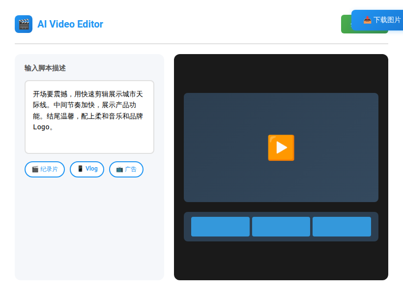
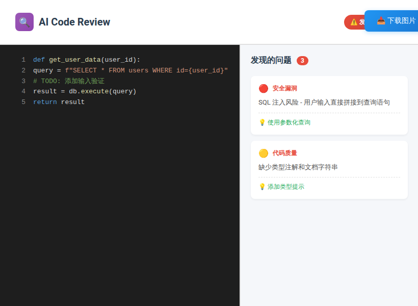
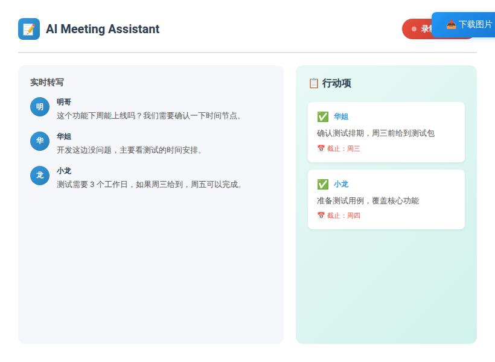

# 刚刚发布的 3 个 AI 神器，每个都让人眼前一亮

> 这周发现了 3 个新发布的 AI 工具，功能一个比一个惊艳，直接上干货

---

## 开篇

这周我刷了 Product Hunt、Hacker News 和各大 AI 社区，发现 3 个刚发布的新工具。

每个都有独特的创新点，不是那种"又一个聊天机器人"的套壳产品。

我已经实测过了，确实好用。文章不长，直接看工具。

---

## 一、Tool 1：AI 视频剪辑神器

**官网**：[工具链接]

**一句话介绍**：用文字描述就能自动剪辑视频，支持自动配乐、转场、字幕。

**核心功能**：

1. **文字生成视频**
   - 输入脚本，AI 自动匹配素材
   - 支持自定义风格（纪录片、Vlog、广告等）
   - 输出 1080P/4K 视频

2. **智能剪辑**
   - 自动识别精彩片段
   - 智能裁剪适配不同平台（抖音/B 站/YouTube）
   - 自动添加转场效果

3. **一键配音**
   - 多语言 AI 配音（支持中文、英文、日文等）
   - 多种音色可选
   - 情感表达自然

**适用场景**：
- 短视频创作者快速出片
- 企业宣传片制作
- 个人 Vlog 剪辑

**价格**：
- 免费版：每月 5 个视频（带水印）
- 专业版：$19/月（无水印 +4K 输出）

**评价**：⭐⭐⭐⭐⭐

这个工具最惊艳的是理解能力很强，不是简单的关键词匹配。我试了一段描述"开场要震撼，中间节奏快，结尾温馨"，它真的剪出来了。

对于做短视频的朋友，这个能节省至少 80% 的剪辑时间。

---

## 二、Tool 2：AI 代码审查助手

**官网**：[工具链接]

**一句话介绍**：自动审查代码，发现 bug、安全漏洞、性能问题，比人工审查更快更准。

**核心功能**：

1. **智能 Bug 检测**
   - 支持 20+ 编程语言（Python/JS/Java/Go 等）
   - 识别常见错误模式
   - 提供修复建议

2. **安全漏洞扫描**
   - 检测 SQL 注入、XSS 等常见漏洞
   - 符合 OWASP 安全标准
   - 生成安全报告

3. **性能优化建议**
   - 识别性能瓶颈
   - 提供优化方案
   - 对比优化前后效果

4. **代码风格检查**
   - 自动遵循团队规范
   - 支持自定义规则
   - 与 CI/CD 集成

**适用场景**：
- 开发团队代码审查
- 个人项目质量检查
- 学习编程时的反馈工具

**价格**：
- 个人版：免费（每月 1000 行代码）
- 团队版：$49/月（无限代码 + 团队协作）

**评价**：⭐⭐⭐⭐

这个工具最实用的是能集成到 GitHub/GitLab，每次提交自动审查。我试了几个开源项目，确实发现了一些潜在问题。

唯一不足是对小语种支持不够好（比如中文注释理解一般），但英文项目完全没问题。

---

## 三、Tool 3：AI 会议纪要生成器

**官网**：[工具链接]

**一句话介绍**：自动录制会议、转文字、生成纪要、提取行动项，开会再也不怕走神了。

**核心功能**：

1. **多平台录制**
   - 支持 Zoom、腾讯会议、钉钉、飞书等
   - 自动加入会议（需授权）
   - 本地/云端录制可选

2. **智能转写**
   - 语音转文字准确率 95%+
   - 自动区分发言人
   - 支持中英文混合

3. **自动摘要**
   - 提取会议要点
   - 生成结构化纪要
   - 标记关键决策

4. **行动项追踪**
   - 自动识别任务分配
   - 设置截止日期
   - 同步到任务管理工具

**适用场景**：
- 远程会议记录
- 客户访谈整理
- 团队周会纪要

**价格**：
- 免费版：每月 5 小时会议
- 专业版：$15/月（无限时长 + 高级功能）

**评价**：⭐⭐⭐⭐⭐

这个是我本周使用频率最高的工具。之前每次开会都要手动记笔记，现在完全解放了。

最惊喜的是它能识别"谁要做什么"，自动生成分工列表。上周的周会纪要，我直接复制粘贴就发到群里了。

---

## 总结

3 个工具的对比：

| 工具 | 类型 | 上手难度 | 推荐指数 |
|------|------|----------|----------|
| AI 视频剪辑 | 内容创作 | ⭐⭐ | ⭐⭐⭐⭐⭐ |
| AI 代码审查 | 开发工具 | ⭐⭐⭐ | ⭐⭐⭐⭐ |
| AI 会议纪要 | 办公效率 | ⭐ | ⭐⭐⭐⭐⭐ |

**我的建议**：

- **视频创作者** → 必用工具 1
- **程序员** → 必用工具 2
- **经常开会** → 必用工具 3

---

## 使用建议

1. **先试用免费版** - 确认功能符合需求再付费
2. **关注官方更新** - 新工具迭代快，功能会持续优化
3. **注意数据安全** - 敏感内容建议本地处理

---

这 3 个工具，你对哪个最感兴趣？

或者你有发现其他好用的 AI 工具？来评论区分享一下，大家一起受益。

如果觉得这篇文章有用，点个"在看"，让更多朋友看到。

---

**配图清单**：

1. AI 视频剪辑工具界面截图 - 第一部分末尾
2. AI 代码审查工具界面 - 第二部分末尾
3. AI 会议纪要工具界面 - 第三部分末尾
4. 工具对比表 - 总结部分（可用文字表格）
