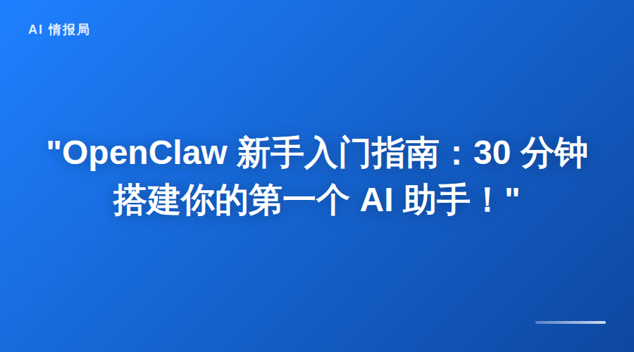

你是不是也想过：要是有个 AI 助手，能帮我盯着服务器、自动整理资料、定时提醒重要事情，该多好？

**OpenClaw 就是干这个的。**

它不是那种只能陪聊的 AI，而是真正能**帮你干活**的助手——在你睡觉时检查系统状态，在你忙碌时整理信息，在你需要时立刻给出建议。

今天这篇教程，带你从零开始搭建自己的 OpenClaw，**30 分钟就能让它跑起来**。

---

## 一、OpenClaw 到底是什么？

简单说，OpenClaw 是一个**AI 自动化框架**。

它让你可以用自然语言给 AI 分配任务，然后 AI 会：
- 调用各种工具（浏览器、文件、API、消息平台）
- 记住你的偏好和历史信息
- 主动执行定时任务（比如每天早上的简报）
- 在你需要时提供帮助

**和普通 AI 的区别**：
- 普通 AI：你问它答，对话结束就忘了
- OpenClaw：有记忆、有工具、能主动干活

---

## 二、快速安装（10 分钟）

### 第一步：检查环境

OpenClaw 需要 Node.js 环境。打开终端，输入：

```bash
node -v
```

如果显示版本号（比如 v22.x.x），说明已安装。如果没有，先去安装 Node.js。

### 第二步：安装 OpenClaw

```bash
npm install -g openclaw
```

安装完成后，验证：

```bash
openclaw --version
```

看到版本号就说明安装成功了。

### 第三步：初始化工作区

```bash
mkdir -p ~/openclaw-workspace
cd ~/openclaw-workspace
openclaw init
```

这会创建你的工作目录和基础配置文件。

---

## 三、核心配置（10 分钟）

OpenClaw 的配置文件都在工作区的 `workspace` 目录下。有几个关键文件需要了解：

### 1. SOUL.md —— AI 的「人格」

这个文件定义了 AI 的行事风格。比如：
- 怎么称呼你
- 说话风格（正式还是随意）
- 什么情况下应该主动提醒

**建议**：花几分钟写清楚你的偏好，AI 会记住并照做。

### 2. MEMORY.md —— 长期记忆

AI 在这里存储重要信息：
- 你的项目进展
- 重要决策
- 需要长期记住的偏好

**使用技巧**：每次完成重要工作后，让 AI 更新 MEMORY.md，下次对话它就能「记得」之前的事情。

### 3. TOOLS.md —— 工具配置

这里存放各种工具的访问信息：
- API 密钥
- 服务器地址
- 消息平台配置

**安全提示**：这个文件包含敏感信息，不要上传到公开仓库。

### 4. HEARTBEAT.md —— 定时任务清单

这是 OpenClaw 的「待办事项」：
- 每天检查什么
- 每周执行什么
- 什么情况下需要提醒你

**示例**：
```markdown
# 每日检查
- 查看未读邮件
- 检查服务器状态
- 确认今日日程

# 每周检查
- 整理本周记忆
- 更新项目进度
```

---

## 四、第一个实战任务（10 分钟）

配置完成后，让 AI 帮你做点实际的事情。以下是三个新手友好的任务：

### 任务 1：晨间简报

让 AI 每天早上给你发一条消息，包含：
- 今天天气
- 今日日程
- 重要新闻摘要

**实现方式**：在 HEARTBEAT.md 添加检查项，配置定时任务。

### 任务 2：自动整理下载文件夹

很多人下载文件夹乱七八糟。让 AI 定期：
- 扫描 ~/Downloads 目录
- 按文件类型分类（图片、文档、安装包）
- 移动到对应文件夹

**实现方式**：编写一个简单的脚本，让 AI 定时执行。

### 任务 3：网站监控

如果你关心某个网站的价格变化、内容更新：
- AI 定时访问指定 URL
- 检测内容变化
- 有变化时立刻通知你

**实现方式**：使用 web_fetch 工具，配合条件判断。

---

## 五、进阶玩法

当你熟悉了基础操作，可以试试这些：

### 1. 多 Agent 协作

启动多个子 Agent 并行处理不同任务：
- 一个负责监控
- 一个负责整理
- 一个负责研究

晚上同时运行，早上收报告。

### 2. 知识库构建

让 AI 从你的文档、笔记中提取知识：
- 识别关键实体（人名、项目、概念）
- 建立关系图谱
- 支持快速查询

### 3. 消息平台集成

把 OpenClaw 连接到：
- 微信（公众号自动发布）
- Telegram（个人通知）
- Discord（团队协作）
- 钉钉/飞书（企业场景）

---

## 六、常见问题

### Q：需要编程基础吗？

**不需要**。大部分任务用自然语言描述即可。但如果你会写脚本，能实现更复杂的功能。

### Q：安全吗？会不会泄露数据？

OpenClaw 运行在你的机器上，数据不会上传到第三方。但要注意：
- 配置文件包含 API 密钥，妥善保管
- 不要给 AI 执行危险命令的权限（如 rm -rf）
- 定期检查 AI 的操作日志

### Q：收费吗？

OpenClaw 本身是开源免费的。但使用某些功能可能需要：
- AI API 调用费用（如调用大模型）
- 第三方服务费用（如短信通知）

### Q：出问题了怎么办？

- 查看日志：`openclaw logs`
- 检查状态：`openclaw status`
- 社区支持：GitHub Issues、Discord

---

## 七、下一步

这篇教程帮你完成了从零到一的部署。接下来可以：

1. **浏览官方文档**：`/usr/lib/node_modules/openclaw/docs` 或 https://docs.openclaw.ai
2. **查看案例库**：GitHub 上有大量真实用例
3. **加入社区**：Discord、微信群，和其他用户交流
4. **开始你的第一个项目**：从一个小任务开始，逐步扩展

---

## 写在最后

OpenClaw 的核心思想很简单：

> **「凡是可以交给 AI 的，就不该占用人类的注意力。」**

你不需要成为技术专家，也不需要花几个月学习。30 分钟部署，然后让它开始帮你干活。

**你的时间，应该花在更有价值的事情上。**

---

**相关资源**：
- 官方文档：https://docs.openclaw.ai
- GitHub 项目：https://github.com/openclaw/openclaw
- 社区 Discord：https://discord.com/invite/clawd
- 案例库：https://github.com/EvoLinkAI/awesome-openclaw-usecases-moltbook

---



