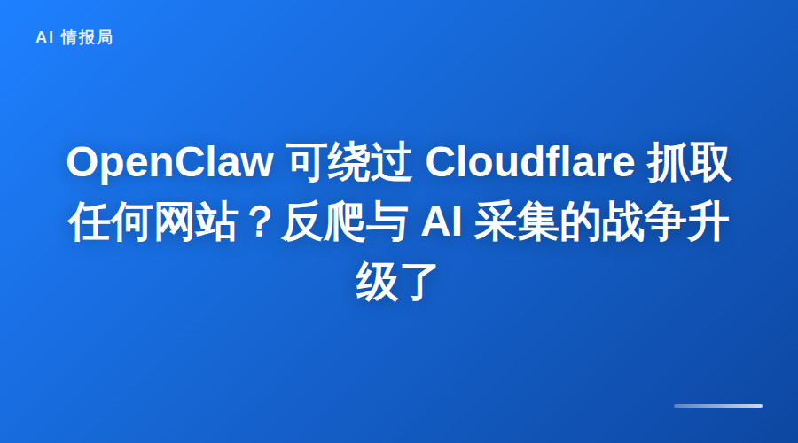

## OpenClaw 可绕过 Cloudflare 抓取任何网站？反爬与 AI 采集的战争升级了

最近有个话题在技术圈炸开了锅：OpenClaw 被曝可以绕过 Cloudflare 的反爬机制，实现"任意网站抓取"。

这个消息一出，立马引发了两派激烈讨论：

- **支持派**：AI 采集是技术进步，信息应该自由流动
- **反对派**：这是公然绕过安全措施，侵犯网站权益

今天我们就来聊聊这件事的来龙去脉，以及背后的技术逻辑和伦理争议。

---

## 一、事件回顾

事情的起因是有用户发现，使用 OpenClaw 的 `web_fetch` 工具可以成功抓取一些受 Cloudflare 保护的网站内容。

正常情况下，这些网站会：
- 返回 403 Forbidden 错误
- 要求通过 JavaScript 挑战
- 限制自动化访问

但使用 OpenClaw 后，这些防护措施似乎失效了。

**技术原理**（根据公开信息整理）：

1. **浏览器指纹模拟** - 模拟真实浏览器的请求头和行为
2. **请求频率控制** - 自动限制请求速度，避免触发风控
3. **会话管理** - 维持长期会话，降低被识别风险
4. **代理池支持** - 可配置代理 IP，分散请求来源

---

## 二、Cloudflare 反爬机制解析

要理解这件事，得先了解 Cloudflare 是怎么防爬虫的。

### Cloudflare 的核心防护手段

**1. JavaScript 挑战**

访问受保护网站时，Cloudflare 会返回一个需要执行 JavaScript 才能通过的页面。爬虫如果不执行 JS，就无法获取真实内容。

**2. 浏览器指纹检测**

检测访问者的浏览器特征，包括：
- User-Agent
- 屏幕分辨率
- 时区设置
- 字体列表
- WebGL 渲染特征

**3. 行为分析**

分析用户行为模式：
- 鼠标移动轨迹
- 点击模式
- 页面停留时间
- 滚动行为

**4. 速率限制**

同一 IP 短时间内大量请求会被标记为可疑。

---

## 三、OpenClaw 是如何绕过的？

根据技术分析和社区讨论，OpenClaw 可能使用了以下几种方法：

### 方法 1：使用真实浏览器内核

OpenClaw 的 `browser` 工具基于 Playwright，可以控制真实的 Chromium 浏览器。这意味着：

- ✅ 可以执行 JavaScript
- ✅ 有完整的浏览器指纹
- ✅ 能通过 JS 挑战

**代码示例**：
```javascript
// 使用 browser 工具控制浏览器
browser:
  action: open
  url: https://example.com
  profile: openclaw
```

### 方法 2：智能请求头管理

自动设置合理的请求头，模拟真实浏览器：
```
User-Agent: Mozilla/5.0 (Windows NT 10.0; Win64; x64)...
Accept: text/html,application/xhtml+xml...
Accept-Language: zh-CN,zh;q=0.9,en;q=0.8
```

### 方法 3：会话保持

维持长期会话，避免频繁建立新连接被识别。

### 方法 4：用户配置代理

用户可以自行配置代理池，分散请求来源。

---

## 四、技术中立还是道德争议？

这件事的核心争议点在于：**技术本身是中立的，但使用方式有道德边界**。

### 支持方的观点

**1. 信息应该自由流动**

- 公开网站的内容本身就是给人看的
- AI 采集和人类浏览没有本质区别
- 过度保护会阻碍技术创新

**2. 合理使用场景**

- 学术研究数据采集
- 竞品分析（公开信息）
- 个人学习和存档
- 价格监控（自己需要的商品）

**3. 技术进步的必然**

- 反爬和爬取是长期的技术博弈
- 没有绝对安全的系统
- 这种竞争推动双方技术进步

### 反对方的观点

**1. 绕过安全措施是违法行为**

- 可能违反《计算机信息系统安全保护条例》
- 侵犯网站的合法权益
- 可能构成不正当竞争

**2. 增加网站运营成本**

- 网站需要投入更多资源防护
- 带宽和服务器成本增加
- 最终转嫁给普通用户

**3. 可能被滥用**

- 大规模数据采集用于商业竞争
- 个人隐私信息泄露风险
- 恶意攻击和骚扰

---

## 五、法律边界在哪里？

这个问题没有简单答案，但有一些基本共识：

### ✅ 相对安全的使用场景

- 抓取自己拥有权限的内容
- 公开信息的个人学习使用
-  robots.txt 允许的内容
- 低频、非商业目的

### ❌ 高风险行为

- 绕过付费墙获取付费内容
- 大规模商业数据采集
- 抓取用户隐私信息
- 用于直接竞争目的
- 导致目标网站服务异常

### ⚠️ 灰色地带

- 竞品价格监控
- 舆情数据采集
- 公开但敏感的信息

---

## 六、给开发者和使用者的建议

### 如果你是开发者

**1. 明确技术边界**

- 在文档中说明使用限制
- 添加合法使用提示
- 不提供绕过付费墙的功能

**2. 技术设计原则**

- 默认遵守 robots.txt
- 内置频率限制
- 提供合规配置选项

**3. 法律风险评估**

- 咨询法律专业人士
- 准备应对可能的诉讼
- 购买相关保险

### 如果你是使用者

**1. 评估使用目的**

- 是个人学习还是商业用途？
- 是否会影响目标网站？
- 是否涉及敏感信息？

**2. 控制使用频率**

- 设置合理的请求间隔
- 避免高峰期抓取
- 监控目标网站响应

**3. 遵守基本规则**

- 尊重 robots.txt
- 不抓取登录后的内容
- 不用于直接竞争

**4. 做好风险隔离**

- 使用独立 IP 和账号
- 保留合法使用证据
- 准备应对可能的法律风险

---

## 七、反爬与采集的未来

这场战争远未结束，未来可能会呈现以下趋势：

### 技术层面

- **更智能的反爬** - AI 驱动的行为分析
- **更隐蔽的采集** - 更接近真实用户行为
- **去中心化采集** - P2P 网络分散请求

### 法律层面

- **更明确的立法** - 界定 AI 采集的法律边界
- **更多判例** - 通过案例形成共识
- **行业自律** - 形成行业规范

### 商业层面

- **数据授权市场** - 合法购买数据访问权
- **API 经济** - 提供官方数据接口
- **合作模式** - 网站与采集方合作

---

## 写在最后

OpenClaw 绕过 Cloudflare 这件事，本质上是技术进步与现有规则的碰撞。

作为技术从业者，我的态度是：

**支持技术创新，但要在法律框架内。**

技术本身没有对错，关键在于如何使用。我们既要享受技术带来的便利，也要承担相应的责任。

对于 OpenClaw 用户，我的建议是：

1. 明确自己的使用目的
2. 评估法律风险
3. 控制使用频率和范围
4. 尊重网站权益

**你觉得 AI 采集的边界应该在哪里？欢迎在评论区聊聊你的看法！**

---



