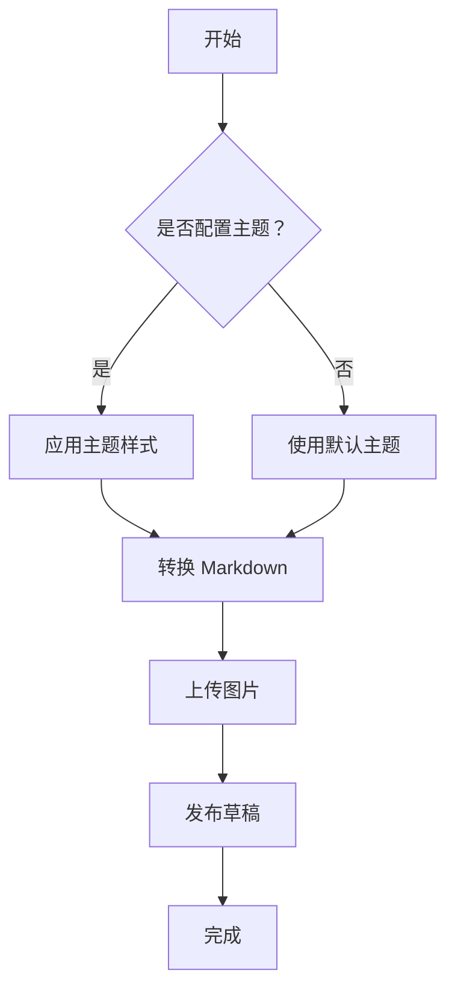
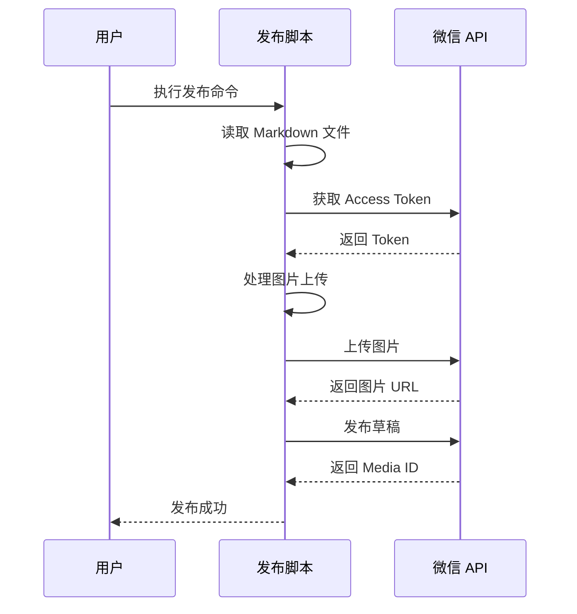

# 增强版发布工具测试

> 这是一篇测试文章，展示新增的 Mermaid 图表、数学公式和多主题样式功能。

## 一、Mermaid 流程图支持

现在支持渲染 Mermaid 流程图，直接在 Markdown 中编写：



## 二、Mermaid 时序图

支持复杂的时序图：



## 三、数学公式支持

### 行内公式

爱因斯坦的质能方程 $E=mc^2$ 是最著名的物理公式之一。

圆的面积公式是 $A = \pi r^2$，其中 $r$ 是半径。

### 块级公式

二次方程的求根公式：

$$
x = \frac{-b \pm \sqrt{b^2 - 4ac}}{2a}
$$

麦克斯韦方程组：

$$
\nabla \cdot \mathbf{E} = \frac{\rho}{\varepsilon_0}
$$

$$
\nabla \cdot \mathbf{B} = 0
$$

## 四、GFM Alert 警告块

> [!NOTE]
> 这是注释块，用于提示额外信息。

> [!TIP]
> 这是提示块，分享实用小技巧。

> [!IMPORTANT]
> 这是重要信息，需要特别关注。

> [!WARNING]
> 这是警告块，提醒潜在风险。

> [!CAUTION]
> 这是 caution 块，用于严重警告。

## 五、多主题样式对比

### 经典主题（default）

玫瑰金配色，经典大方。

### 优雅主题（grace）

紫色主题，带阴影效果，更加优雅。

使用方式：
```bash
npm run publish:enhanced article.md -T grace
```

### 简洁主题（simple）

蓝色主题，现代简洁风格。

使用方式：
```bash
npm run publish:enhanced article.md -T simple
```

## 六、代码块高亮

```javascript
// JavaScript 代码示例
async function publishArticle(markdown) {
  const html = await convertToHTML(markdown)
  const mediaId = await publishDraft(html)
  return mediaId
}
```

```python
# Python 代码示例
def calculate_quadratic(a, b, c):
    delta = b**2 - 4*a*c
    x1 = (-b + delta**0.5) / (2*a)
    x2 = (-b - delta**0.5) / (2*a)
    return x1, x2
```

## 七、表格样式

| 主题名称 | 主色调 | 特点 |
|---------|--------|------|
| default | 玫瑰金 | 经典大方 |
| grace | 紫色 | 优雅阴影 |
| simple | 蓝色 | 简洁现代 |

## 总结

增强版发布工具现在支持：

- ✅ **Mermaid 图表** - 流程图、时序图、类图等
- ✅ **数学公式** - 行内公式和块级公式
- ✅ **多主题样式** - default/grace/simple 三种主题
- ✅ **GFM Alert** - 注释、提示、警告等警告块

使用命令：

```bash
# 使用默认主题
npm run publish:enhanced article.md

# 指定主题
npm run publish:enhanced article.md -T grace
```
