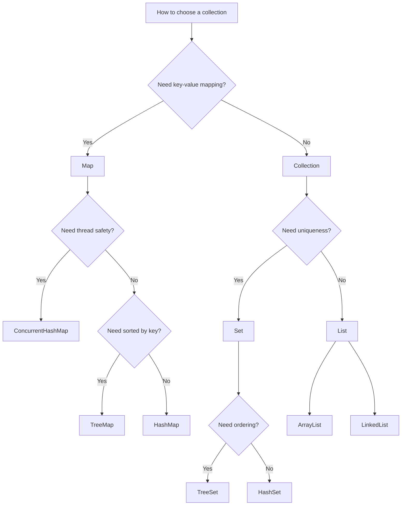

## Why do we need collections? ##

- Most code is essentially **about processing data**, so how we store and operate on data is critical.

- **Arrays**: fixed capacity, expensive insert/delete operations, and lack of rich, well-encapsulated APIs.

- **Collections framework**: a unified set of interfaces, mature implementations (List / Set / Queue / Map), plus rich algorithms.

  **Result**: code becomes easier to write and maintain, and there are dedicated thread-safe variants for concurrent scenarios.

## What is a collection? ##

- A container for storing data
- Supports generics
- Provides unified abstraction interfaces
- Comes with rich APIs
- Often provides concurrent variants

## Types of collections ##

The Java Collections Framework can be roughly divided into **two main interface families**. Under **Collection** there are three major branches, while `Map` does **not** extend `Collection`—it is a separate top-level interface (but still part of the collections framework):

- **Collection** interface: single elements
  - **List**: ordered sequence that allows duplicates
    - `ArrayList`: backed by an `Object[]` array
    - `LinkedList`: backed by a doubly linked list
    - `Vector`: also backed by an `Object[]` array (legacy design, not recommended)
  - **Set**: stores unique elements
    - `HashSet`: unordered, unique elements; backed by a `HashMap`
      - `LinkedHashSet`: subclass of `HashSet`, backed by a `LinkedHashMap`
    - `SortedSet`: ordered Set interface
      - `TreeSet`: ordered and unique; backed by a red–black tree
  - **Queue**: for processing elements in order
    - `PriorityQueue`: priority queue backed by a binary heap (min-heap by default)
    - `Deque`: double-ended queue that can work as both a stack and a queue
      - `ArrayDeque`: backed by an `Object[]` array
      - `LinkedList`: backed by a doubly linked list
- **Map** interface: key–value pairs with unique keys and potentially duplicate values
  - `HashMap`: hash table using chaining to resolve collisions; allows `null` keys and `null` values
    - `LinkedHashMap`: hash table + doubly linked list that **preserves iteration order** on top of `HashMap`
  - `Hashtable`: older design with weaker performance (not recommended)
  - `SortedMap`:
    - `TreeMap`: backed by a red–black tree and ordered by key
  - `ConcurrentHashMap`:
    - Designed for high-concurrency, multi-threaded scenarios

  
  The above diagram is from the Javaguide website.

## Usage scenarios ##

First, decide whether you need key–value mapping:

- If **yes**, start with a Map:
  - Use `TreeMap` if you need sorted keys.
  - Use `ConcurrentHashMap` if you need thread safety in high-concurrency scenarios.
  - In many other cases, `HashMap` is the default choice.

- If you only need to store elements (no keys), look at the `Collection` hierarchy:
  - Choose a `Set` implementation if you need uniqueness.
  - Choose a `List` implementation if duplicates are allowed.
  - Choose a `Queue` implementation if you need queue or stack semantics.

