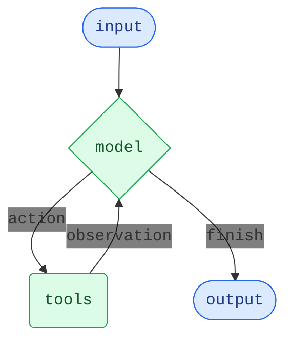

Agents（智能体）将语言模型与 [Tools（工具）](/oss/langchain/tools) 结合起来，创建能够推理任务、决定使用哪些工具并迭代地朝着解决方案努力的系统。

:::python
@[`create_agent`] 提供了一个生产就绪的 agent 实现。
:::
:::js
`createAgent()` 提供了一个生产就绪的 agent 实现。
:::

[LLM Agent 在循环中运行工具以实现目标](https://simonwillison.net/2025/Sep/18/agents/)。
Agent 会一直运行直到满足停止条件——即当模型发出最终输出或达到迭代限制时。



<Info>

:::python
@[`create_agent`] 使用 [LangGraph](/oss/langgraph/overview) 构建基于 **graph**（图）的 agent 运行时。Graph 由节点（步骤）和边（连接）组成，定义了 agent 如何处理信息。Agent 在这个 graph 中移动，执行节点，如 model 节点（调用模型）、tools 节点（执行工具）或 middleware。
:::
:::js
`createAgent()` 使用 [LangGraph](/oss/langgraph/overview) 构建基于 **graph**（图）的 agent 运行时。Graph 由节点（步骤）和边（连接）组成，定义了 agent 如何处理信息。Agent 在这个 graph 中移动，执行节点，如 model 节点（调用模型）、tools 节点（执行工具）或 middleware。
:::

了解更多关于 [Graph API](/oss/langgraph/graph-api) 的信息。

</Info>

## 核心组件

### Model（模型）

[Model](/oss/langchain/models) 是 agent 的推理引擎。它可以通过多种方式指定，支持静态和动态模型选择。

#### 静态模型

静态模型在创建 agent 时配置一次，并在整个执行过程中保持不变。这是最常见和直接的方法。

要从 <Tooltip tip="遵循 `provider:model` 格式的字符串（例如 openai:gpt-5）" cta="查看映射" href="https://reference.langchain.com/python/langchain/models/#langchain.chat_models.init_chat_model(model)">模型标识符字符串</Tooltip> 初始化静态模型：

:::python
```python wrap
from langchain.agents import create_agent

agent = create_agent("openai:gpt-5", tools=tools)
```
:::
:::js
```ts wrap
import { createAgent } from "langchain";

const agent = createAgent({
  model: "openai:gpt-5",
  tools: []
});
```
:::

:::python
<Tip>
    模型标识符字符串支持自动推断（例如，`"gpt-5"` 将被推断为 `"openai:gpt-5"`）。参考 @[reference][init_chat_model(model)] 查看完整的模型标识符字符串映射列表。
</Tip>

为了更多地控制模型配置，可以使用 provider 包直接初始化模型实例。在这个例子中，我们使用 @[`ChatOpenAI`]。查看 [Chat models](/oss/integrations/chat) 了解其他可用的 chat model 类。

```python wrap
from langchain.agents import create_agent
from langchain_openai import ChatOpenAI

model = ChatOpenAI(
    model="gpt-5",
    temperature=0.1,
    max_tokens=1000,
    timeout=30
    # ... (其他参数)
)
agent = create_agent(model, tools=tools)
```

Model 实例让你完全控制配置。当你需要设置特定的 [parameters](/oss/langchain/models#parameters)（如 `temperature`、`max_tokens`、`timeouts`、`base_url` 和其他 provider 特定的设置）时使用它们。参考 [reference](/oss/integrations/providers/all_providers) 查看你的 model 上可用的参数和方法。
:::
:::js
模型标识符字符串使用 `provider:model` 格式（例如 `"openai:gpt-5"`）。你可能想要更多地控制模型配置，在这种情况下，你可以使用 provider 包直接初始化模型实例：

```ts wrap
import { createAgent } from "langchain";
import { ChatOpenAI } from "@langchain/openai";

const model = new ChatOpenAI({
  model: "gpt-4.1",
  temperature: 0.1,
  maxTokens: 1000,
  timeout: 30
});

const agent = createAgent({
  model,
  tools: []
});
```

Model 实例让你完全控制配置。当你需要设置特定的 parameters（如 `temperature`、`max_tokens`、`timeouts`）或配置 API keys、`base_url` 和其他 provider 特定的设置时使用它们。参考 [API reference](/oss/integrations/providers/) 查看你的 model 上可用的参数和方法。
:::

#### 动态模型

动态模型在 <Tooltip tip="Agent 的执行环境，包含不可变的配置和在整个 agent 执行过程中持续的上下文数据（例如用户 ID、会话详情或应用程序特定的配置）。">runtime</Tooltip> 基于当前的 <Tooltip tip="流经 agent 执行的数据，包括 messages、custom fields 以及任何需要在处理过程中跟踪和 potentially modified 的信息（例如用户偏好或工具使用统计）。">state</Tooltip> 和 context 进行选择。这实现了复杂的路由逻辑和成本优化。

:::python

要使用动态模型，使用 @[`@wrap_model_call`] 装饰器创建 middleware，在 request 中修改 model：

```python
from langchain_openai import ChatOpenAI
from langchain.agents import create_agent
from langchain.agents.middleware import wrap_model_call, ModelRequest, ModelResponse


basic_model = ChatOpenAI(model="gpt-4.1-mini")
advanced_model = ChatOpenAI(model="gpt-4.1")

@wrap_model_call
def dynamic_model_selection(request: ModelRequest, handler) -> ModelResponse:
    """根据对话复杂度选择模型。"""
    message_count = len(request.state["messages"])

    if message_count > 10:
        # 对较长的对话使用高级模型
        model = advanced_model
    else:
        model = basic_model

    return handler(request.override(model=model))

agent = create_agent(
    model=basic_model,  # 默认模型
    tools=tools,
    middleware=[dynamic_model_selection]
)
```

<Warning>
使用结构化输出时，不支持预绑定模型（已经调用过 @[`bind_tools`][BaseChatModel.bind_tools] 的模型）。如果你需要在结构化输出中使用动态模型选择，确保传递给 middleware 的模型未预绑定。
</Warning>

:::
:::js

要使用动态模型，使用 `wrapModelCall` 创建 middleware，在 request 中修改 model：

```ts
import { ChatOpenAI } from "@langchain/openai";
import { createAgent, createMiddleware } from "langchain";

const basicModel = new ChatOpenAI({ model: "gpt-4.1-mini" });
const advancedModel = new ChatOpenAI({ model: "gpt-4.1" });

const dynamicModelSelection = createMiddleware({
  name: "DynamicModelSelection",
  wrapModelCall: (request, handler) => {
    // 根据对话复杂度选择模型
    const messageCount = request.messages.length;

    return handler({
        ...request,
        model: messageCount > 10 ? advancedModel : basicModel,
    });
  },
});

const agent = createAgent({
  model: "gpt-4.1-mini", // 基础模型（当 messageCount ≤ 10 时使用）
  tools,
  middleware: [dynamicModelSelection],
});
```

有关 middleware 和高级模式更多信息，请参阅 [middleware documentation](/oss/langchain/middleware)。
:::

<Tip>
有关模型配置详情，请参阅 [Models](/oss/langchain/models)。有关动态模型选择模式，请参阅 [Dynamic model in middleware](/oss/langchain/middleware#dynamic-model)。
</Tip>

### Tools（工具）

Tools 赋予 agents 采取行动的能力。Agents 超越了简单的仅模型工具绑定，通过促进：

- 多个工具按顺序调用（由单个 prompt 触发）
- 适当时并行调用工具
- 基于先前结果的动态工具选择
- 工具重试逻辑和错误处理
- 跨工具调用的 state persistence

更多信息，请参阅 [Tools](/oss/langchain/tools)。

#### 静态工具

静态工具在创建 agent 时定义，并在整个执行过程中保持不变。这是最常见和直接的方法。

要定义带有静态工具的 agent，将工具列表传递给 agent。

:::python

<Tip>
Tools 可以指定为普通的 Python 函数或 <Tooltip tip="可以 suspend execution 并在 later time resume 的方法">coroutines</Tooltip>。

[tool decorator](/oss/langchain/tools#create-tools) 可用于自定义 tool names、descriptions、argument schemas 和其他属性。
</Tip>

```python wrap
from langchain.tools import tool
from langchain.agents import create_agent


@tool
def search(query: str) -> str:
    """搜索信息。"""
    return f"Results for: {query}"

@tool
def get_weather(location: str) -> str:
    """获取某个位置的天气信息。"""
    return f"Weather in {location}: Sunny, 72°F"

agent = create_agent(model, tools=[search, get_weather])
```
:::
:::js
```ts wrap
import * as z from "zod";
import { createAgent, tool } from "langchain";

const search = tool(
  ({ query }) => `Results for: ${query}`,
  {
    name: "search",
    description: "Search for information",
    schema: z.object({
      query: z.string().describe("The query to search for"),
    }),
  }
);

const getWeather = tool(
  ({ location }) => `Weather in ${location}: Sunny, 72°F`,
  {
    name: "get_weather",
    description: "Get weather information for a location",
    schema: z.object({
      location: z.string().describe("The location to get weather for"),
    }),
  }
);

const agent = createAgent({
  model: "gpt-4.1",
  tools: [search, getWeather],
});
```
:::

如果提供空工具列表，agent 将仅包含单个 LLM 节点，没有 tool-calling 能力。

#### 动态工具

使用动态工具，agent 可用的工具集在 runtime 修改，而不是一开始就全部定义。并非每个工具都适合每种情况。过多的工具可能会压倒模型（overload context）并增加错误；过少则限制能力。动态工具选择能够根据 authentication state、user permissions、feature flags 或 conversation stage 调整可用工具集。

根据工具是否提前已知，有两种方法：

<Tabs>
  <Tab title="过滤预注册的工具">

    当所有可能的工具在 agent 创建时已知，你可以预注册它们，并根据 state、permissions 或 context 动态过滤哪些暴露给模型。

    <Tabs>
      <Tab title="State">
        仅在某些 conversation milestones 后启用高级工具：

        :::python

        ```python
        from langchain.agents import create_agent
        from langchain.agents.middleware import wrap_model_call, ModelRequest, ModelResponse
        from typing import Callable

        @wrap_model_call
        def state_based_tools(
            request: ModelRequest,
            handler: Callable[[ModelRequest], ModelResponse]
        ) -> ModelResponse:
            """基于 conversation State 过滤工具。"""
            # 从 State 读取：检查用户是否已认证
            state = request.state
            is_authenticated = state.get("authenticated", False)
            message_count = len(state["messages"])

            # 仅在认证后启用敏感工具
            if not is_authenticated:
                tools = [t for t in request.tools if t.name.startswith("public_")]
                request = request.override(tools=tools)
            elif message_count < 5:
                # 在对话早期限制工具
                tools = [t for t in request.tools if t.name != "advanced_search"]
                request = request.override(tools=tools)

            return handler(request)

        agent = create_agent(
            model="gpt-4.1",
            tools=[public_search, private_search, advanced_search],
            middleware=[state_based_tools]
        )
        ```

        :::

        :::js

        ```typescript
        import { createMiddleware, tool } from "langchain";
        import { createDeepAgent } from "deepagents";

        const stateBasedTools = createMiddleware({
            name: "StateBasedTools",
            wrapModelCall: (request, handler) => {
                // 从 State 读取：检查认证和对话长度
                const state = request.state as typeof request.state & {
                    authenticated?: boolean;
                };
                const isAuthenticated = state.authenticated ?? false;
                const messageCount = state.messages.length;

                let filteredTools = request.tools;

                // 仅在认证后启用敏感工具
                if (!isAuthenticated) {
                    filteredTools = request.tools.filter(
                        (t: any) => typeof t.name === "string" && t.name.startsWith("public_"),
                    );
                } else if (messageCount < 5) {
                    filteredTools = request.tools.filter(
                        (t: any) => typeof t.name === "string" && t.name !== "advanced_search",
                    );
                }

                return handler({ ...request, tools: filteredTools });
            },
        });

        const agent = await createDeepAgent({
            model: "claude-sonnet-4-20250514",
            tools: tools,
            middleware: [stateBasedTools] as any,
        });
        ```

        :::
      </Tab>

      <Tab title="Store">
        基于 Store 中的用户偏好或 feature flags 过滤工具：

        :::python

        ```python
        from dataclasses import dataclass
        from langchain.agents import create_agent
        from langchain.agents.middleware import wrap_model_call, ModelRequest, ModelResponse
        from typing import Callable
        from langgraph.store.memory import InMemoryStore

        @dataclass
        class Context:
            user_id: str

        @wrap_model_call
        def store_based_tools(
            request: ModelRequest,
            handler: Callable[[ModelRequest], ModelResponse]
        ) -> ModelResponse:
            """基于 Store 偏好过滤工具。"""
            user_id = request.runtime.context.user_id

            # 从 Store 读取：获取用户启用的功能
            store = request.runtime.store
            feature_flags = store.get(("features",), user_id)

            if feature_flags:
                enabled_features = feature_flags.value.get("enabled_tools", [])
                # 仅包含为该用户启用的工具
                tools = [t for t in request.tools if t.name in enabled_features]
                request = request.override(tools=tools)

            return handler(request)

        agent = create_agent(
            model="gpt-4.1",
            tools=[search_tool, analysis_tool, export_tool],
            middleware=[store_based_tools],
            context_schema=Context,
            store=InMemoryStore()
        )
        ```

        :::

        :::js

        ```typescript
        import { createMiddleware } from "langchain";
        import { createDeepAgent } from "deepagents";
        import * as z from "zod";
        import {
        InMemoryStore,
        } from "@langchain/langgraph";


        const contextSchema = z.object({
        userId: z.string(),
        });

        const storeBasedTools = createMiddleware({
        name: "StoreBasedTools",
        contextSchema,
        wrapModelCall: async (request, handler) => {
            const userId =
            (request.runtime?.context as { userId?: string } | undefined)?.userId ??
            "user-123";

            // 从 Store 读取：获取用户启用的功能
            const runtimeStore = request.runtime?.store as InMemoryStore | undefined;
            const rawFlags = (await runtimeStore?.get(
            ["features"],
            userId as string
            )) as unknown;
            const featureFlags = rawFlags as FeatureFlags | undefined;

            let filteredTools = request.tools;

            if (featureFlags) {
            const enabledFeatures = featureFlags.enabledTools || [];
            filteredTools = request.tools.filter((t) =>
                enabledFeatures.includes(t.name as string)
            );
            }

            return handler({ ...request, tools: filteredTools });
        },
        });

        const agent = await createDeepAgent({
        model: "claude-sonnet-4-20250514",
        backend: backendFactory,
        store,
        checkpointer,
        tools,
        middleware: [storeBasedTools] as any,
        });
        ```

        :::
      </Tab>

      <Tab title="Runtime Context">
        基于 Runtime Context 中的 user permissions 过滤工具：

        :::python

        ```python
        from dataclasses import dataclass
        from langchain.agents import create_agent
        from langchain.agents.middleware import wrap_model_call, ModelRequest, ModelResponse
        from typing import Callable

        @dataclass
        class Context:
            user_role: str

        @wrap_model_call
        def context_based_tools(
            request: ModelRequest,
            handler: Callable[[ModelRequest], ModelResponse]
        ) -> ModelResponse:
            """基于 Runtime Context permissions 过滤工具。"""
            # 从 Runtime Context 读取：获取用户角色
            if request.runtime is None or request.runtime.context is None:
                # 如果未提供 context，默认为 viewer（最严格）
                user_role = "viewer"
            else:
                user_role = request.runtime.context.user_role

            if user_role == "admin":
                # 管理员获得所有工具
                pass
            elif user_role == "editor":
                # 编辑者不能删除
                tools = [t for t in request.tools if t.name != "delete_data"]
                request = request.override(tools=tools)
            else:
                # 查看者获得只读工具
                tools = [t for t in request.tools if t.name.startswith("read_")]
                request = request.override(tools=tools)

            return handler(request)

        agent = create_agent(
            model="gpt-4.1",
            tools=[read_data, write_data, delete_data],
            middleware=[context_based_tools],
            context_schema=Context
        )
        ```

        :::

        :::js

        ```typescript
        import * as z from "zod";
        import { createMiddleware } from "langchain";
        import { createDeepAgent } from "deepagents";

        const contextSchema = z.object({
        userRole: z.string(),
        });

        const contextBasedTools = createMiddleware({
        name: "ContextBasedTools",
        contextSchema,
        wrapModelCall: (request, handler) => {
            // 从 Runtime Context 读取：获取用户角色
            const userRole = request.runtime.context.userRole;

            let filteredTools = request.tools;

            if (userRole === "admin") {
            // 管理员获得所有工具
            } else if (userRole === "editor") {
            filteredTools = request.tools.filter(t => t.name !== "delete_data");
            } else {
            filteredTools = request.tools.filter(
                (t) => (t.name as string).startsWith("read_")
            );
            }

            return handler({ ...request, tools: filteredTools });
        },
        });

        const agent = await createDeepAgent({
        model: "claude-sonnet-4-20250514",
        store,
        checkpointer,
        tools,
        middleware: [contextBasedTools] as any,
        });
        ```

        :::
      </Tab>
    </Tabs>

    这种方法最适合：
    - 所有可能的工具在 compile/startup 时已知
    - 你想要基于 permissions、feature flags 或 conversation state 进行过滤
    - 工具是静态的，但它们的可用性是动态的

    查看 [Dynamically selecting tools](/oss/langchain/middleware/custom#dynamically-selecting-tools) 了解更多示例。

  </Tab>

  <Tab title="Runtime 工具注册">

    当工具在 runtime 被发现或创建时（例如，从 MCP server 加载、基于用户数据生成或从 remote registry 获取），你需要同时注册工具并动态处理它们的执行。

    这需要两个 middleware hooks：
    1. `wrap_model_call` - 将动态工具添加到 request
    2. `wrap_tool_call` - 处理动态添加工具的执行

    :::python

    ```python
    from langchain.tools import tool
    from langchain.agents import create_agent
    from langchain.agents.middleware import AgentMiddleware, ModelRequest, ToolCallRequest

    # 一个将在 runtime 动态添加的工具
    @tool
    def calculate_tip(bill_amount: float, tip_percentage: float = 20.0) -> str:
        """计算账单的小费金额。"""
        tip = bill_amount * (tip_percentage / 100)
        return f"Tip: ${tip:.2f}, Total: ${bill_amount + tip:.2f}"

    class DynamicToolMiddleware(AgentMiddleware):
        """注册和处理动态工具的 middleware。"""

        def wrap_model_call(self, request: ModelRequest, handler):
            # 将动态工具添加到 request
            # 这可以从 MCP server、database 等加载
            updated = request.override(tools=[*request.tools, calculate_tip])
            return handler(updated)

        def wrap_tool_call(self, request: ToolCallRequest, handler):
            # 处理动态工具的执行
            if request.tool_call["name"] == "calculate_tip":
                return handler(request.override(tool=calculate_tip))
            return handler(request)

    agent = create_agent(
        model="gpt-4o",
        tools=[get_weather],  # 这里只注册静态工具
        middleware=[DynamicToolMiddleware()],
    )

    # agent 现在可以使用 get_weather 和 calculate_tip
    result = agent.invoke({
        "messages": [{"role": "user", "content": "Calculate a 20% tip on $85"}]
    })
    ```

    :::

    :::js

    ```typescript
    import { createAgent, createMiddleware, tool } from "langchain";
    import * as z from "zod";

    // 一个将在 runtime 动态添加的工具
    const calculateTip = tool(
      ({ billAmount, tipPercentage = 20 }) => {
        const tip = billAmount * (tipPercentage / 100);
        return `Tip: $${tip.toFixed(2)}, Total: $${(billAmount + tip).toFixed(2)}`;
      },
      {
        name: "calculate_tip",
        description: "Calculate the tip amount for a bill",
        schema: z.object({
          billAmount: z.number().describe("The bill amount"),
          tipPercentage: z.number().default(20).describe("Tip percentage"),
        }),
      }
    );

    const dynamicToolMiddleware = createMiddleware({
      name: "DynamicToolMiddleware",
      wrapModelCall: (request, handler) => {
        // 将动态工具添加到 request
        // 这可以从 MCP server、database 等加载
        return handler({
          ...request,
          tools: [...request.tools, calculateTip],
        });
      },
      wrapToolCall: (request, handler) => {
        // 处理动态工具的执行
        if (request.toolCall.name === "calculate_tip") {
          return handler({ ...request, tool: calculateTip });
        }
        return handler(request);
      },
    });

    const agent = createAgent({
      model: "gpt-4o",
      tools: [getWeather], // 这里只注册静态工具
      middleware: [dynamicToolMiddleware],
    });

    // agent 现在可以使用 getWeather 和 calculateTip
    const result = await agent.invoke({
      messages: [{ role: "user", content: "Calculate a 20% tip on $85" }],
    });
    ```

    :::

    这种方法最适合：
    - 工具在 runtime 被发现（例如，从 MCP server）
    - 工具基于用户数据或配置动态生成
    - 你正在集成外部 tool registries

    <Note>
    `wrap_tool_call` hook 对于 runtime 注册的工具是必需的，因为 agent 需要知道如何执行不在原始工具列表中的工具。没有它，agent 将不知道如何调用动态添加的工具。
    </Note>

  </Tab>
</Tabs>

<Tip>
要了解更多关于 tools 的信息，请参阅 [Tools](/oss/langchain/tools)。
</Tip>

#### 工具错误处理

:::python

要自定义如何处理工具错误，使用 @[`@wrap_tool_call`] 装饰器创建 middleware：

```python wrap
from langchain.agents import create_agent
from langchain.agents.middleware import wrap_tool_call
from langchain.messages import ToolMessage


@wrap_tool_call
def handle_tool_errors(request, handler):
    """用自定义消息处理工具执行错误。"""
    try:
        return handler(request)
    except Exception as e:
        # 返回自定义错误消息给模型
        return ToolMessage(
            content=f"Tool error: Please check your input and try again. ({str(e)})",
            tool_call_id=request.tool_call["id"]
        )

agent = create_agent(
    model="gpt-4.1",
    tools=[search, get_weather],
    middleware=[handle_tool_errors]
)
```

当工具失败时，agent 将返回带有自定义错误消息的 @[`ToolMessage`]：

```python
[
    ...
    ToolMessage(
        content="Tool error: Please check your input and try again. (division by zero)",
        tool_call_id="..."
    ),
    ...
]
```

:::
:::js

要自定义如何处理工具错误，在 custom middleware 中使用 `wrapToolCall` hook：

```ts wrap
import { createAgent, createMiddleware, ToolMessage } from "langchain";

const handleToolErrors = createMiddleware({
  name: "HandleToolErrors",
  wrapToolCall: async (request, handler) => {
    try:
      return await handler(request);
    } catch (error) {
      // 返回自定义错误消息给模型
      return new ToolMessage({
        content: `Tool error: Please check your input and try again. (${error})`,
        tool_call_id: request.toolCall.id!,
      });
    }
  },
});

const agent = createAgent({
  model: "gpt-4.1",
  tools: [
    /* ... */
  ],
  middleware: [handleToolErrors],
});
```

当工具失败时，agent 将返回带有自定义错误消息的 @[`ToolMessage`]。
:::

#### ReAct 循环中的工具使用

Agents 遵循 ReAct（"Reasoning + Acting"）模式，在 brief reasoning steps 与 targeted tool calls 之间交替，并将 resulting observations 反馈到后续决策中，直到它们能够提供最终答案。

<Accordion title="ReAct 循环示例">
**Prompt:** 识别当前最受欢迎的无线耳机并验证可用性。

```
================================ Human Message =================================

Find the most popular wireless headphones right now and check if they're in stock
```

* **Reasoning**: "Popularity 是 time-sensitive 的，我需要使用提供的 search tool。"
* **Acting**: 调用 `search_products("wireless headphones")`

```
================================== Ai Message ==================================
Tool Calls:
  search_products (call_abc123)
 Call ID: call_abc123
  Args:
    query: wireless headphones
```
```
================================= Tool Message =================================

Found 5 products matching "wireless headphones". Top 5 results: WH-1000XM5, ...
```

* **Reasoning**: "在回答之前，我需要确认排名最高的项目的可用性。"
* **Acting**: 调用 `check_inventory("WH-1000XM5")`

```
================================== Ai Message ==================================
Tool Calls:
  check_inventory (call_def456)
 Call ID: call_def456
  Args:
    product_id: WH-1000XM5
```
```
================================= Tool Message =================================

Product WH-1000XM5: 10 units in stock
```

* **Reasoning**: "我已经有了最受欢迎的型号及其库存状态。我现在可以回答用户的问题了。"
* **Acting**: 生成最终答案

```
================================== Ai Message ==================================

I found wireless headphones (model WH-1000XM5) with 10 units in stock...
```
</Accordion>

### System prompt（系统提示）

:::python
你可以通过提供 prompt 来塑造 agent 处理任务的方式。@[`system_prompt`] 参数可以作为 string 提供：
:::

:::js
你可以通过提供 prompt 来塑造 agent 处理任务的方式。`systemPrompt` 参数可以作为 string 提供：
:::

:::python
```python wrap
agent = create_agent(
    model,
    tools,
    system_prompt="You are a helpful assistant. Be concise and accurate."
)
```
:::
:::js
```ts wrap
const agent = createAgent({
  model,
  tools,
  systemPrompt: "You are a helpful assistant. Be concise and accurate.",
});
```
:::

:::python
当未提供 @[`system_prompt`] 时，agent 将直接从 messages 推断其任务。

@[`system_prompt`] 参数接受 `str` 或 @[`SystemMessage`]。使用 `SystemMessage` 让你更多地控制 prompt 结构，这对于 provider 特定的功能很有用，如 [Anthropic's prompt caching](/oss/integrations/chat/anthropic#prompt-caching)：

```python wrap
from langchain.agents import create_agent
from langchain.messages import SystemMessage, HumanMessage

literary_agent = create_agent(
    model="anthropic:claude-sonnet-4-5",
    system_prompt=SystemMessage(
        content=[
            {
                "type": "text",
                "text": "You are an AI assistant tasked with analyzing literary works.",
            },
            {
                "type": "text",
                "text": "<the entire contents of 'Pride and Prejudice'>",
                "cache_control": {"type": "ephemeral"}
            }
        ]
    )
)

result = literary_agent.invoke(
    {"messages": [HumanMessage("Analyze the major themes in 'Pride and Prejudice'.")]}
)
```

带有 `{"type": "ephemeral"}` 的 `cache_control` 字段告诉 Anthropic 缓存该内容块，减少使用相同 system prompt 的重复请求的 latency 和 costs。
:::

:::js
当未提供 `systemPrompt` 时，agent 将直接从 messages 推断其任务。

`systemPrompt` 参数接受 `string` 或 `SystemMessage`。使用 `SystemMessage` 让你更多地控制 prompt 结构，这对于 provider 特定的功能很有用，如 [Anthropic's prompt caching](/oss/integrations/chat/anthropic#prompt-caching)：

```ts wrap
import { createAgent } from "langchain";
import { SystemMessage, HumanMessage } from "@langchain/core/messages";

const literaryAgent = createAgent({
  model: "anthropic:claude-sonnet-4-5",
  systemPrompt: new SystemMessage({
    content: [
      {
        type: "text",
        text: "You are an AI assistant tasked with analyzing literary works.",
      },
      {
        type: "text",
        text: "<the entire contents of 'Pride and Prejudice'>",
        cache_control: { type: "ephemeral" }
      }
    ]
  })
});

const result = await literary_agent.invoke({
  messages: [new HumanMessage("Analyze the major themes in 'Pride and Prejudice'.")]
});
```

带有 `{ type: "ephemeral" }` 的 `cache_control` 字段告诉 Anthropic 缓存该内容块，减少使用相同 system prompt 的重复请求的 latency 和 costs。
:::

#### 动态 system prompt

对于需要基于 runtime context 或 agent state 修改 system prompt 的更高级用例，你可以使用 [middleware](/oss/langchain/middleware)。

:::python

@[`@dynamic_prompt`] 装饰器创建 middleware，基于 model request 生成 system prompts：

```python wrap
from typing import TypedDict

from langchain.agents import create_agent
from langchain.agents.middleware import dynamic_prompt, ModelRequest


class Context(TypedDict):
    user_role: str

@dynamic_prompt
def user_role_prompt(request: ModelRequest) -> str:
    """基于用户角色生成 system prompt。"""
    user_role = request.runtime.context.get("user_role", "user")
    base_prompt = "You are a helpful assistant."

    if user_role == "expert":
        return f"{base_prompt} Provide detailed technical responses."
    elif user_role == "beginner":
        return f"{base_prompt} Explain concepts simply and avoid jargon."

    return base_prompt

agent = create_agent(
    model="gpt-4.1",
    tools=[web_search],
    middleware=[user_role_prompt],
    context_schema=Context
)

# system prompt 将基于 context 动态设置
result = agent.invoke(
    {"messages": [{"role": "user", "content": "Explain machine learning"}]},
    context={"user_role": "expert"}
)
```
:::

:::js
```typescript wrap
import * as z from "zod";
import { createAgent, dynamicSystemPromptMiddleware } from "langchain";

const contextSchema = z.object({
  userRole: z.enum(["expert", "beginner"]),
});

const agent = createAgent({
  model: "gpt-4.1",
  tools: [/* ... */],
  contextSchema,
  middleware: [
    dynamicSystemPromptMiddleware<z.infer<typeof contextSchema>>((state, runtime) => {
      const userRole = runtime.context.userRole || "user";
      const basePrompt = "You are a helpful assistant.";

      if (userRole === "expert") {
        return `${basePrompt} Provide detailed technical responses.`;
      } else if (userRole === "beginner") {
        return `${basePrompt} Explain concepts simply and avoid jargon.`;
      }
      return basePrompt;
    }),
  ],
});

// system prompt 将基于 context 动态设置
const result = await agent.invoke(
  { messages: [{ role: "user", content: "Explain machine learning" }] },
  { context: { userRole: "expert" } }
);
```
:::

<Tip>
有关 message types 和 formatting 更多信息，请参阅 [Messages](/oss/langchain/messages)。有关 comprehensive middleware documentation，请参阅 [Middleware](/oss/langchain/middleware)。
</Tip>

### Name（名称）

:::python
为 agent 设置可选的 @[`name`][create_agent(name)]。当在 [multi-agent systems](/oss/langchain/multi-agent) 中将 agent 作为 subgraph 添加时，这用作 node identifier：

```python
agent = create_agent(
    model,
    tools,
    name="research_assistant"
)
```
:::
:::js
为 agent 设置可选的 `name`。当在 [multi-agent systems](/oss/langchain/multi-agent) 中将 agent 作为 subgraph 添加时，这用作 node identifier：

```ts
const agent = createAgent({
  model,
  tools,
  name: "research_assistant",
});
```
:::

<Warning>
    优先使用 `snake_case` 作为 agent 名称（例如，`research_assistant` 而不是 `Research Assistant`）。一些 model providers 拒绝包含空格或特殊字符的名称并报错。仅使用字母数字字符、下划线和连字符可确保与所有 providers 兼容。同样的规则也适用于 [tool names](/oss/langchain/tools)。
</Warning>

## Invocation（调用）

你可以通过传递对其 [`State`](/oss/langgraph/graph-api#state) 的 update 来调用 agent。所有 agents 在其 state 中都包含 [sequence of messages](/oss/langgraph/use-graph-api#messagesstate)；要调用 agent，传递新 message：

:::python
```python
result = agent.invoke(
    {"messages": [{"role": "user", "content": "What's the weather in San Francisco?"}]}
)
```
:::
:::js
```typescript
await agent.invoke({
  messages: [{ role: "user", content: "What's the weather in San Francisco?" }],
})
```
:::

对于来自 agent 的 streaming steps 和/或 tokens，请参阅 [streaming](/oss/langchain/streaming) guide。

否则，agent 遵循 LangGraph [Graph API](/oss/langgraph/use-graph-api) 并支持所有相关方法，如 `stream` 和 `invoke`。

<Tip>
使用 [LangSmith](/langsmith/home) 来 trace、debug 和 evaluate 你的 agents。
</Tip>

## 高级概念

### Structured output（结构化输出）

:::python

在某些情况下，你可能希望 agent 以特定格式返回输出。LangChain 通过 @[`response_format`][create_agent(response_format)] 参数提供结构化输出策略。

#### ToolStrategy

`ToolStrategy` 使用 artificial tool calling 生成结构化输出。这适用于任何支持 tool calling 的模型。当 provider-native structured output（通过 [`ProviderStrategy`](#ProviderStrategy)）不可用或不可靠时，应使用 `ToolStrategy`。

```python wrap
from pydantic import BaseModel
from langchain.agents import create_agent
from langchain.agents.structured_output import ToolStrategy


class ContactInfo(BaseModel):
    name: str
    email: str
    phone: str

agent = create_agent(
    model="gpt-4.1-mini",
    tools=[search_tool],
    response_format=ToolStrategy(ContactInfo)
)

result = agent.invoke({
    "messages": [{"role": "user", "content": "Extract contact info from: John Doe, john@example.com, (555) 123-4567"}]
})

result["structured_response"]
# ContactInfo(name='John Doe', email='john@example.com', phone='(555) 123-4567')
```

#### ProviderStrategy

`ProviderStrategy` 使用 model provider 的 native structured output generation。这更可靠，但仅适用于支持 native structured output 的 providers：

```python wrap
from langchain.agents.structured_output import ProviderStrategy

agent = create_agent(
    model="gpt-4.1",
    response_format=ProviderStrategy(ContactInfo)
)
```

<Note>
从 `langchain 1.0` 开始，简单地传递 schema（例如，`response_format=ContactInfo`）如果模型支持 native structured output 将默认使用 `ProviderStrategy`。否则将回退到 `ToolStrategy`。
</Note>

:::
:::js
在某些情况下，你可能希望 agent 以特定格式返回输出。LangChain 提供了一种简单、通用的方法，使用 `responseFormat` 参数。

```ts wrap
import * as z from "zod";
import { createAgent } from "langchain";

const ContactInfo = z.object({
  name: z.string(),
  email: z.string(),
  phone: z.string(),
});

const agent = createAgent({
  model: "gpt-4.1",
  responseFormat: ContactInfo,
});

const result = await agent.invoke({
  messages: [
    {
      role: "user",
      content: "Extract contact info from: John Doe, john@example.com, (555) 123-4567",
    },
  ],
});

console.log(result.structuredResponse);
// {
//   name: 'John Doe',
//   email: 'john@example.com',
//   phone: '(555) 123-4567'
// }
```
:::
<Tip>
    要了解 structured output，请参阅 [Structured output](/oss/langchain/structured-output)。
</Tip>

### Memory（记忆）

Agents 通过 message state 自动维护 conversation history。你还可以配置 agent 使用 custom state schema 在 conversation 期间记住额外信息。

存储在 state 中的信息可以被认为是 agent 的 [short-term memory](/oss/langchain/short-term-memory)：

:::python

Custom state schemas 必须将 @[`AgentState`] 扩展为 `TypedDict`。

有两种方法定义 custom state：
1. 通过 [middleware](/oss/langchain/middleware)（首选）
2. 通过 @[`state_schema`] 在 @[`create_agent`] 上

#### 通过 middleware 定义 state

当你的 custom state 需要被特定 middleware hooks 和附加到该 middleware 的 tools 访问时，使用 middleware 定义 custom state。

```python
from langchain.agents import AgentState
from langchain.agents.middleware import AgentMiddleware
from typing import Any


class CustomState(AgentState):
    user_preferences: dict

class CustomMiddleware(AgentMiddleware):
    state_schema = CustomState
    tools = [tool1, tool2]

    def before_model(self, state: CustomState, runtime) -> dict[str, Any] | None:
        ...

agent = create_agent(
    model,
    tools=tools,
    middleware=[CustomMiddleware()]
)

# agent 现在可以跟踪 messages 之外的额外 state
result = agent.invoke({
    "messages": [{"role": "user", "content": "I prefer technical explanations"}],
    "user_preferences": {"style": "technical", "verbosity": "detailed"},
})
```

#### 通过 `state_schema` 定义 state

使用 @[`state_schema`] 参数作为快捷方式来定义仅用于 tools 的 custom state。

```python
from langchain.agents import AgentState


class CustomState(AgentState):
    user_preferences: dict

agent = create_agent(
    model,
    tools=[tool1, tool2],
    state_schema=CustomState
)
# agent 现在可以跟踪 messages 之外的额外 state
result = agent.invoke({
    "messages": [{"role": "user", "content": "I prefer technical explanations"}],
    "user_preferences": {"style": "technical", "verbosity": "detailed"},
})
```

<Note>
从 `langchain 1.0` 开始，custom state schemas **必须**是 `TypedDict` 类型。Pydantic models 和 dataclasses 不再支持。有关更多详情，请参阅 [v1 migration guide](/oss/migrate/langchain-v1#state-type-restrictions)。
</Note>

:::
:::js
```ts wrap
import { z } from "zod/v4";
import { StateSchema, MessagesValue } from "@langchain/langgraph";
import { createAgent } from "langchain";

const CustomAgentState = new StateSchema({
  messages: MessagesValue,
  userPreferences: z.record(z.string(), z.string()),
});

const customAgent = createAgent({
  model: "gpt-4.1",
  tools: [],
  stateSchema: CustomAgentState,
});
```
:::

:::python
<Note>
    通过 middleware 定义 custom state 优先于通过 @[`state_schema`] 在 @[`create_agent`] 上定义，因为它允许你将 state extensions 概念性地限定在相关的 middleware 和 tools 范围内。

    @[`state_schema`] 仍然在 @[`create_agent`] 上支持向后兼容。
</Note>
:::

<Tip>
    要了解更多关于 memory 的信息，请参阅 [Memory](/oss/concepts/memory)。有关实现跨 sessions 持续的 long-term memory 信息，请参阅 [Long-term memory](/oss/langchain/long-term-memory)。
</Tip>

### Streaming（流式传输）

我们已经看到如何使用 `invoke` 调用 agent 以获得最终响应。如果 agent 执行多个步骤，这可能需要一段时间。为了显示中间进度，我们可以 streaming back messages 当它们发生时。

:::python
```python
from langchain.messages import AIMessage, HumanMessage

for chunk in agent.stream({
    "messages": [{"role": "user", "content": "Search for AI news and summarize the findings"}]
}, stream_mode="values"):
    # 每个 chunk 包含该点的完整 state
    latest_message = chunk["messages"][-1]
    if latest_message.content:
        if isinstance(latest_message, HumanMessage):
            print(f"User: {latest_message.content}")
        elif isinstance(latest_message, AIMessage):
            print(f"Agent: {latest_message.content}")
    elif latest_message.tool_calls:
        print(f"Calling tools: {[tc['name'] for tc in latest_message.tool_calls]}")
```
:::
:::js
```ts
const stream = await agent.stream(
  {
    messages: [{
      role: "user",
      content: "Search for AI news and summarize the findings"
    }],
  },
  { streamMode: "values" }
);

for await (const chunk of stream) {
  // 每个 chunk 包含该点的完整 state
  const latestMessage = chunk.messages.at(-1);
  if (latestMessage?.content) {
    console.log(`Agent: ${latestMessage.content}`);
  } else if (latestMessage?.tool_calls) {
    const toolCallNames = latestMessage.tool_calls.map((tc) => tc.name);
    console.log(`Calling tools: ${toolCallNames.join(", ")}`);
  }
}
```
:::

<Tip>
有关 streaming 更多信息，请参阅 [Streaming](/oss/langchain/streaming)。
</Tip>

### Middleware

[Middleware](/oss/langchain/middleware) 为在 execution 的不同阶段自定义 agent behavior 提供了强大的扩展性。你可以使用 middleware 来：

- 在 model 被调用之前处理 state（例如，message trimming、context injection）
- 修改或验证 model 的 response（例如，guardrails、content filtering）
- 用 custom logic 处理 tool execution errors
- 基于 state 或 context 实现 dynamic model selection
- 添加 custom logging、monitoring 或 analytics

Middleware 无缝集成到 agent 的 execution 中，允许你在关键点 intercept 和 modify data flow，而无需更改 core agent logic。

:::python
<Tip>
有关 comprehensive middleware documentation，包括装饰器如 @[`@before_model`]、@[`@after_model`] 和 @[`@wrap_tool_call`]，请参阅 [Middleware](/oss/langchain/middleware)。
</Tip>
:::

:::js
<Tip>
有关 comprehensive middleware documentation，包括 hooks 如 `beforeModel`、`afterModel` 和 `wrapToolCall`，请参阅 [Middleware](/oss/langchain/middleware)。
</Tip>
:::
