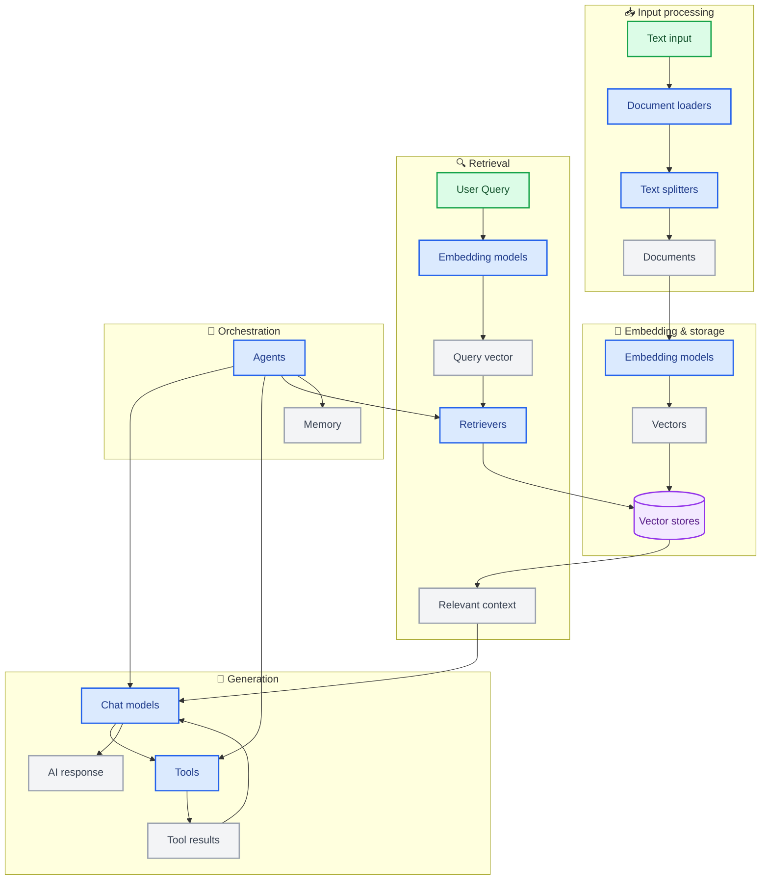
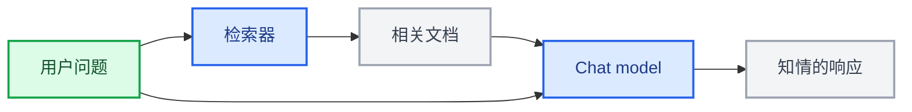
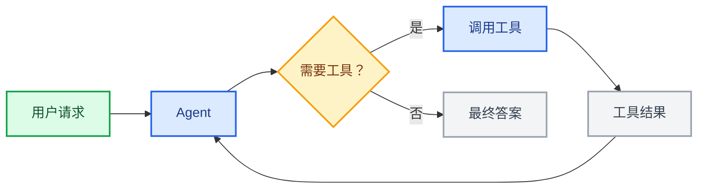
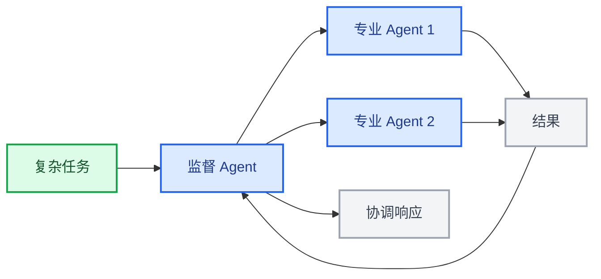

LangChain 的强大之处在于其组件如何协同工作以创建复杂的 AI 应用。本页提供了展示不同组件之间关系的图表。

## 核心组件生态系统

下图展示了 LangChain 的主要组件如何连接形成完整的 AI 应用：

### 组件如何连接

每个组件层都建立在前一层的基础上：

1. **输入处理（Input processing）** – 将原始数据转换为结构化文档
2. **嵌入与存储（Embedding & storage）** – 将文本转换为可搜索的向量表示
3. **检索（Retrieval）** – 根据用户查询查找相关信息
4. **生成（Generation）** – 使用 AI 模型创建响应，可选择使用工具
5. **编排（Orchestration）** – 通过 agent 和记忆系统协调一切

## 组件类别

LangChain 将组件组织为以下主要类别：

| 类别 | 目的 | 关键组件 | 用例 |
|----------|---------|---------------|-----------|
| **[模型（Models）](/oss/langchain/models)** | AI 推理和生成 | Chat models、LLMs、Embedding models | 文本生成、推理、语义理解 |
| **[工具（Tools）](/oss/langchain/tools)** | 外部能力 | APIs、数据库等 | 网页搜索、数据访问、计算 |
| **[Agent](/oss/langchain/agents)** | 编排和推理 | ReAct agents、tool calling agents | 非确定性工作流、决策制定 |
| **[记忆（Memory）](/oss/langchain/short-term-memory)** | 上下文保留 | 消息历史、自定义状态 | 对话、有状态的交互 |
| **[检索器（Retrievers）](/oss/integrations/retrievers)** | 信息访问 | 向量检索器、网页检索器 | RAG、知识库搜索 |
| **[文档处理（Document processing）](/oss/integrations/document_loaders)** | 数据摄入 | Loaders、splitters、transformers | PDF 处理、网页抓取 |
| **[向量存储（Vector Stores）](/oss/integrations/vectorstores)** | 语义搜索 | Chroma、Pinecone、FAISS | 相似度搜索、嵌入存储 |

## 常见模式

### RAG（检索增强生成）

### 带工具的 Agent

### 多 Agent 系统

## 了解更多

- [创建 Agent](/oss/langchain/agents)
- [使用工具](/oss/langchain/tools)
- [浏览集成](/oss/integrations/providers/overview)
