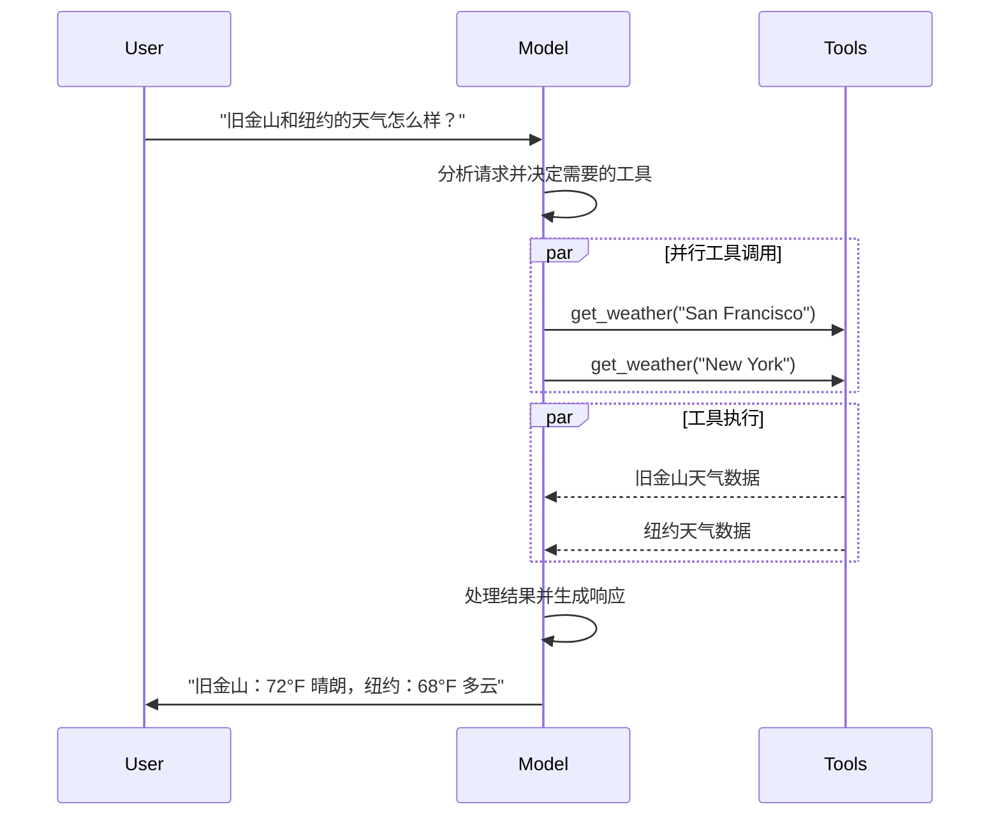
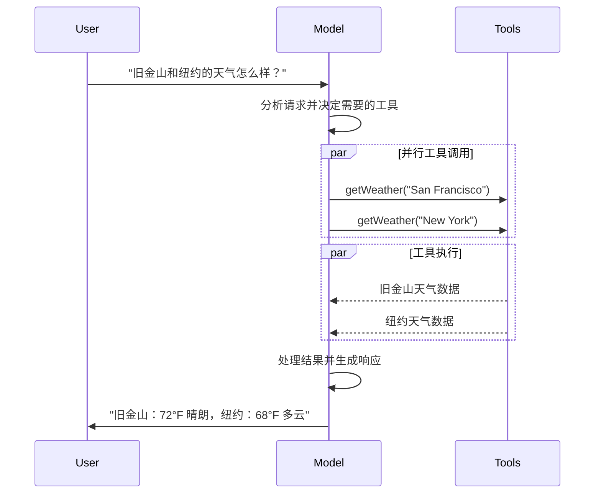

import ChatModelTabsPy from '/snippets/chat-model-tabs.mdx';
import ChatModelTabsJS from '/snippets/chat-model-tabs-js.mdx';

[LLM](https://en.wikipedia.org/wiki/Large_language_model)（大型语言模型）是强大的 AI 工具，能够像人类一样理解和生成文本。它们用途广泛，无需针对每项任务进行专门训练即可编写内容、翻译语言、摘要信息和回答问题。

除了文本生成之外，许多模型还支持：

* <Icon icon="hammer" size={16} /> [工具调用（Tool calling）](#tool-calling) - 调用外部工具（如数据库查询或 API 调用）并在响应中使用结果。
* <Icon icon="layout-grid" size={16} /> [结构化输出（Structured output）](#structured-output) - 模型的响应被限制为遵循定义的格式。
* <Icon icon="photo" size={16} /> [多模态（Multimodality）](#multimodal) - 处理和返回文本以外的数据，如图像、音频和视频。
* <Icon icon="brain" size={16} /> [推理（Reasoning）](#reasoning) - 模型执行多步推理以得出结论。

模型是 [Agent](/oss/langchain/agents) 的推理引擎。它们驱动 Agent 的决策过程，确定调用哪些工具、如何解释结果以及何时提供最终答案。

你选择的模型的质量和性能直接影响 Agent 的基线可靠性和性能。不同的模型擅长不同的任务——有些更擅长遵循复杂指令，有些更擅长结构化推理，还有一些支持更大的上下文窗口以处理更多信息。

LangChain 的标准模型接口让你可以访问许多不同的提供商集成，这使得你可以轻松尝试和切换模型，找到最适合你用例的模型。

<Info>
    有关特定提供商的集成信息和功能，请参阅提供商的 [Chat Model 页面](/oss/integrations/chat)。
</Info>

## 基本用法

模型可以通过两种方式使用：

1. **与 Agent 一起使用** - 在创建 [Agent](/oss/langchain/agents#model) 时可以动态指定模型。
2. **独立使用** - 模型可以直接调用（在 Agent 循环之外），用于文本生成、分类或提取等任务，无需 Agent 框架。

相同的模型接口在这两种场景中都适用，这让你可以灵活地从简单开始，并根据需要扩展到更复杂的基于 Agent 的工作流程。

### 初始化模型

:::python
在 LangChain 中开始使用独立模型的最简单方法是使用 @[`init_chat_model`] 从你选择的 Chat Model 提供商初始化一个（示例如下）：

<ChatModelTabsPy />
```python
response = model.invoke("为什么鹦鹉会说话？")
```

请参阅 @[`init_chat_model`][init_chat_model] 了解更多详情，包括如何传递模型 [参数](#parameters) 的信息。
:::

:::js
在 LangChain 中开始使用独立模型的最简单方法是使用 `initChatModel` 从你选择的 [Chat Model 提供商](/oss/integrations/chat) 初始化一个（示例如下）：

<ChatModelTabsJS />
```typescript
const response = await model.invoke("为什么鹦鹉会说话？");
```
请参阅 @[`initChatModel`][initChatModel] 了解更多详情，包括如何传递模型 [参数](#parameters) 的信息。
:::

### 支持的模型

LangChain 支持所有主要的模型提供商，包括 OpenAI、Anthropic、Google、Azure、AWS Bedrock 等。每个提供商提供多种具有不同功能的模型。有关 LangChain 中支持的完整模型列表，请参阅 [集成页面](/oss/integrations/providers/overview)。

### 关键方法

<Card title="Invoke（调用）" href="#invoke" icon="send" arrow="true" horizontal>
    模型接收消息作为输入，并在生成完整响应后输出消息。
</Card>
<Card title="Stream（流式）" href="#stream" icon="broadcast" arrow="true" horizontal>
    调用模型，但在生成时实时流式输出。
</Card>
<Card title="Batch（批量）" href="#batch" icon="grip-vertical" arrow="true" horizontal>
    将多个请求批量发送到模型以进行更高效的处理。
</Card>

<Info>
    除了 Chat Model 之外，LangChain 还支持其他相关技术，如嵌入模型和向量存储。有关详细信息，请参阅 [集成页面](/oss/integrations/providers/overview)。
</Info>

## 参数

Chat Model 接受可用于配置其行为的参数。支持的完整参数集因模型和提供商而异，但标准参数包括：

<ParamField body="model" type="string" required>
   要与提供商一起使用的特定模型的名称或标识符。你也可以使用 '{model_provider}:{model}' 格式在单个参数中同时指定模型及其提供商，例如 'openai:o1'。
</ParamField>

:::python
<ParamField body="api_key" type="string">
    与模型提供商进行身份验证所需的密钥。这通常在你注册访问模型时颁发。通常通过设置 <Tooltip tip="一个在程序外部设置值的变量，通常通过操作系统或微服务内置的功能。">环境变量</Tooltip> 来访问。
</ParamField>
:::

:::js
<ParamField body="apiKey" type="string">
    与模型提供商进行身份验证所需的密钥。这通常在你注册访问模型时颁发。通常通过设置 <Tooltip tip="一个在程序外部设置值的变量，通常通过操作系统或微服务内置的功能。">环境变量</Tooltip> 来访问。
</ParamField>
:::

<ParamField body="temperature" type="number">
    控制模型输出的随机性。较高的数字使响应更有创意；较低的数字使响应更确定。
</ParamField>

:::python
<ParamField body="max_tokens" type="number">
    限制响应中的 <Tooltip tip="模型读取和生成的基本单位。提供商可能有不同的定义，但一般来说，它们可以代表整个单词或单词的一部分。">token</Tooltip> 总数，有效地控制输出的长度。
</ParamField>
:::

:::js
<ParamField body="maxTokens" type="number">
    限制响应中的 <Tooltip tip="模型读取和生成的基本单位。提供商可能有不同的定义，但一般来说，它们可以代表整个单词或单词的一部分。">token</Tooltip> 总数，有效地控制输出的长度。
</ParamField>
:::

<ParamField body="timeout" type="number">
    等待模型响应的最长时间（以秒为单位），超过此时间将取消请求。
</ParamField>

:::python
<ParamField body="max_retries" type="number" default="6">
    如果请求因网络超时或速率限制等问题失败，系统将尝试重新发送请求的最大次数。重试使用带抖动的指数退避。网络错误、速率限制（429）和服务器错误（5xx）会自动重试。客户端错误（如 401（未授权）或 404）不会重试。对于不可靠网络上的长时间运行的 [Agent](/oss/deepagents/overview) 任务，考虑将此值增加到 10-15。
</ParamField>
:::

:::js
<ParamField body="maxRetries" type="number" default="6">
    如果请求因网络超时或速率限制等问题失败，系统将尝试重新发送请求的最大次数。重试使用带抖动的指数退避。网络错误、速率限制（429）和服务器错误（5xx）会自动重试。客户端错误（如 401（未授权）或 404）不会重试。对于不可靠网络上的长时间运行的 [Agent](/oss/deepagents/overview) 任务，考虑将此值增加到 10-15。
</ParamField>
:::

:::python
使用 @[`init_chat_model`]，将这些参数作为内联 <Tooltip tip="任意关键字参数" cta="了解更多" href="https://www.w3schools.com/python/python_args_kwargs.asp">`**kwargs`</Tooltip> 传递：

```python 使用模型参数初始化
model = init_chat_model(
    "claude-sonnet-4-6",
    # 传递给模型的参数：
    temperature=0.7,
    timeout=30,
    max_tokens=1000,
    max_retries=6,  # 默认值；不可靠网络可增加此值
)
```
:::

:::js
使用 `initChatModel`，将这些参数作为内联参数传递：

```typescript 使用模型参数初始化
const model = await initChatModel(
    "claude-sonnet-4-6",
    { temperature: 0.7, timeout: 30, maxTokens: 1000, maxRetries: 6 }
)
```
:::

<Info>
    每个 Chat Model 集成可能有额外的参数用于控制特定提供商的功能。

    例如，@[`ChatOpenAI`] 有 `use_responses_api` 用于指定是使用 OpenAI Responses API 还是 Completions API。

    要查找给定 Chat Model 支持的所有参数，请前往 [Chat Model 集成](/oss/integrations/chat) 页面。
</Info>

---

## 调用

必须调用模型才能生成输出。有三种主要的调用方法，每种适用于不同的用例。

### Invoke（调用）

调用模型最直接的方法是对单条消息或消息列表使用 @[`invoke()`][BaseChatModel.invoke]。

:::python
```python 单条消息
response = model.invoke("为什么鹦鹉有彩色的羽毛？")
print(response)
```
:::

:::js
```typescript 单条消息
const response = await model.invoke("为什么鹦鹉有彩色的羽毛？");
console.log(response);
```
:::

可以向 Chat Model 提供消息列表来表示对话历史。每条消息都有一个角色，模型用它来指示谁在对话中发送了消息。

有关角色、类型和内容的更多详情，请参阅 [Messages](/oss/langchain/messages) 指南。

:::python
```python 字典格式
conversation = [
    {"role": "system", "content": "你是一个将英语翻译成法语的有用助手。"},
    {"role": "user", "content": "翻译：I love programming."},
    {"role": "assistant", "content": "J'adore la programmation."},
    {"role": "user", "content": "翻译：I love building applications."}
]

response = model.invoke(conversation)
print(response)  # AIMessage("J'adore créer des applications.")
```

```python 消息对象
from langchain.messages import HumanMessage, AIMessage, SystemMessage

conversation = [
    SystemMessage("你是一个将英语翻译成法语的有用助手。"),
    HumanMessage("翻译：I love programming."),
    AIMessage("J'adore la programmation."),
    HumanMessage("翻译：I love building applications.")
]

response = model.invoke(conversation)
print(response)  # AIMessage("J'adore créer des applications.")
```
:::

:::js
```typescript 对象格式
const conversation = [
  { role: "system", content: "你是一个将英语翻译成法语的有用助手。" },
  { role: "user", content: "翻译：I love programming." },
  { role: "assistant", content: "J'adore la programmation." },
  { role: "user", content: "翻译：I love building applications." },
];

const response = await model.invoke(conversation);
console.log(response);  // AIMessage("J'adore créer des applications.")
```

```typescript 消息对象
import { HumanMessage, AIMessage, SystemMessage } from "langchain";

const conversation = [
  new SystemMessage("你是一个将英语翻译成法语的有用助手。"),
  new HumanMessage("翻译：I love programming."),
  new AIMessage("J'adore la programmation."),
  new HumanMessage("翻译：I love building applications."),
];

const response = await model.invoke(conversation);
console.log(response);  // AIMessage("J'adore créer des applications.")
```
:::

<Info>
    如果你的调用返回类型是字符串，请确保你使用的是 Chat Model 而不是 LLM。传统的文本补全 LLM 直接返回字符串。LangChain Chat Model 以 "Chat" 为前缀，例如 @[`ChatOpenAI`](/oss/integrations/chat/openai)。
</Info>

### Stream（流式）

大多数模型可以在生成输出时流式传输其内容。通过渐进式显示输出，流式传输显著改善用户体验，特别是对于较长的响应。

调用 @[`stream()`][BaseChatModel.stream] 返回一个 <Tooltip tip="一个按顺序渐进式提供集合中每个项访问的对象。">迭代器</Tooltip>，它在生成时产生输出块。你可以使用循环实时处理每个块：

:::python
<CodeGroup>
    ```python 基本文本流式
    for chunk in model.stream("为什么鹦鹉有彩色的羽毛？"):
        print(chunk.text, end="|", flush=True)
    ```

    ```python 流式工具调用、推理和其他内容
    for chunk in model.stream("天空是什么颜色的？"):
        for block in chunk.content_blocks:
            if block["type"] == "reasoning" and (reasoning := block.get("reasoning")):
                print(f"推理：{reasoning}")
            elif block["type"] == "tool_call_chunk":
                print(f"工具调用块：{block}")
            elif block["type"] == "text":
                print(block["text"])
            else:
                ...
    ```
</CodeGroup>
:::

:::js
<CodeGroup>
    ```typescript 基本文本流式
    const stream = await model.stream("为什么鹦鹉有彩色的羽毛？");
    for await (const chunk of stream) {
      console.log(chunk.text)
    }
    ```

    ```typescript 流式工具调用、推理和其他内容
    const stream = await model.stream("天空是什么颜色的？");
    for await (const chunk of stream) {
      for (const block of chunk.contentBlocks) {
        if (block.type === "reasoning") {
          console.log(`推理：${block.reasoning}`);
        } else if (block.type === "tool_call_chunk") {
          console.log(`工具调用块：${block}`);
        } else if (block.type === "text") {
          console.log(block.text);
        } else {
          ...
        }
      }
    }
    ```
</CodeGroup>
:::

与 [`invoke()`](#invoke) 不同（后者在模型完成生成完整响应后返回单个 @[`AIMessage`][AIMessage]），`stream()` 返回多个 @[`AIMessageChunk`][AIMessageChunk] 对象，每个对象包含输出文本的一部分。重要的是，流中的每个块都设计为可以通过求和聚合成完整消息：

:::python
```python 构建 AIMessage
full = None  # None | AIMessageChunk
for chunk in model.stream("天空是什么颜色的？"):
    full = chunk if full is None else full + chunk
    print(full.text)

# 天空
# 天空是
# 天空通常是
# 天空通常是蓝色的
# ...

print(full.content_blocks)
# [{"type": "text", "text": "天空通常是蓝色的..."}]
```
:::

:::js
```typescript 构建 AIMessage
let full: AIMessageChunk | null = null;
for await (const chunk of stream) {
  full = full ? full.concat(chunk) : chunk;
  console.log(full.text);
}

// 天空
// 天空是
// 天空通常是
// 天空通常是蓝色的
// ...

console.log(full.contentBlocks);
// [{"type": "text", "text": "天空通常是蓝色的..."}]
```
:::

生成的消息可以像使用 [`invoke()`](#invoke) 生成的消息一样处理——例如，它可以聚合到消息历史中并作为对话上下文传递回模型。

<Warning>
    仅当程序中的所有步骤都知道如何处理块流时，流式传输才有效。例如，需要在处理之前将整个输出存储到内存中的应用程序就不具备流式传输能力。
</Warning>

<Accordion title="高级流式传输主题">
    <Accordion title="流式事件">
        :::python
        LangChain Chat Model 还可以使用 `astream_events()` 流式传输语义事件。

        这简化了基于事件类型和其他元数据的过滤，并将在后台聚合完整消息。请参阅下面的示例。

        ```python
        async for event in model.astream_events("Hello"):

            if event["event"] == "on_chat_model_start":
                print(f"输入：{event['data']['input']}")

            elif event["event"] == "on_chat_model_stream":
                print(f"Token: {event['data']['chunk'].text}")

            elif event["event"] == "on_chat_model_end":
                print(f"完整消息：{event['data']['output'].text}")

            else:
                pass
        ```
        ```txt
        输入：Hello
        Token: Hi
        Token:  there
        Token: !
        Token:  How
        Token:  can
        Token:  I
        ...
        完整消息：Hi there! How can I help today?
        ```

        <Tip>
            请参阅 @[`astream_events()`][BaseChatModel.astream_events] 参考了解事件类型和其他详情。
        </Tip>
        :::

        :::js
        LangChain Chat Model 还可以使用
        [`streamEvents()`][BaseChatModel.streamEvents] 流式传输语义事件。

        这简化了基于事件类型和其他元数据的过滤，并将在后台聚合完整消息。请参阅下面的示例。

        ```typescript
        const stream = await model.streamEvents("Hello");
        for await (const event of stream) {
            if (event.event === "on_chat_model_start") {
                console.log(`输入：${event.data.input}`);
            }
            if (event.event === "on_chat_model_stream") {
                console.log(`Token: ${event.data.chunk.text}`);
            }
            if (event.event === "on_chat_model_end") {
                console.log(`完整消息：${event.data.output.text}`);
            }
        }
        ```
        ```txt
        输入：Hello
        Token: Hi
        Token:  there
        Token: !
        Token:  How
        Token:  can
        Token:  I
        ...
        完整消息：Hi there! How can I help today?
        ```

        请参阅 @[`streamEvents()`][BaseChatModel.streamEvents] 参考了解事件类型和其他详情。
        :::
    </Accordion>
    <Accordion title='"自动流式" Chat Model'>
        LangChain 通过在某些情况下自动启用流式模式简化了 Chat Model 的流式传输，即使你没有显式调用流式方法。当你使用非流式调用方法但仍希望流式传输整个应用程序（包括 Chat Model 的中间结果）时，这特别有用。

        例如，在 [LangGraph Agent](/oss/langchain/agents) 中，你可以在节点中调用 `model.invoke()`，但如果在流式模式下运行，LangChain 会自动委托给流式传输。

        #### 工作原理

        当你 `invoke()` 一个 Chat Model 时，如果 LangChain 检测到你要流式传输整个应用程序，它会自动切换到内部流式模式。就使用 invoke 的代码而言，调用的结果是一样的；然而，当 Chat Model 被流式传输时，LangChain 会负责在 LangChain 的回调系统中调用 @[`on_llm_new_token`] 事件。

        :::python
        回调事件允许 LangGraph `stream()` 和 `astream_events()` 实时显示 Chat Model 的输出。
        :::
        :::js
        回调事件允许 LangGraph `stream()` 和 `streamEvents()` 实时显示 Chat Model 的输出。
        :::
    </Accordion>
</Accordion>

### Batch（批量）

将独立请求集合批量处理到模型可以显著提高性能并降低成本，因为处理可以并行完成：

:::python
```python 批量
responses = model.batch([
    "为什么鹦鹉有彩色的羽毛？",
    "飞机是如何飞行的？",
    "什么是量子计算？"
])
for response in responses:
    print(response)
```

<Note>
    本节介绍 Chat Model 方法 @[`batch()`][BaseChatModel.batch]，它在客户端并行化模型调用。

    它**不同于**推理提供商支持的批量 API，如 [OpenAI](https://platform.openai.com/docs/guides/batch) 或 [Anthropic](https://platform.claude.com/docs/en/build-with-claude/batch-processing#message-batches-api)。
</Note>

默认情况下，@[`batch()`][BaseChatModel.batch] 只返回整个批次的最终输出。如果你想在每个输入完成生成时接收其输出，可以使用 @[`batch_as_completed()`][BaseChatModel.batch_as_completed] 流式传输结果：

```python 在完成后产生批量响应
for response in model.batch_as_completed([
    "为什么鹦鹉有彩色的羽毛？",
    "飞机是如何飞行的？",
    "什么是量子计算？"
]):
    print(response)
```
<Note>
    使用 @[`batch_as_completed()`][BaseChatModel.batch_as_completed] 时，结果可能乱序到达。每个结果都包含输入索引，以便在需要时匹配以重建原始顺序。
</Note>

<Tip>
    当使用 @[`batch()`][BaseChatModel.batch] 或 @[`batch_as_completed()`][BaseChatModel.batch_as_completed] 处理大量输入时，你可能想要控制最大并行调用数。这可以通过在 @[`RunnableConfig`] 字典中设置 @[`max_concurrency`][RunnableConfig(max_concurrency)] 属性来完成。

    ```python 带最大并发数的批量
    model.batch(
        list_of_inputs,
        config={
            'max_concurrency': 5,  # 限制为 5 个并行调用
        }
    )
    ```

    请参阅 @[`RunnableConfig`] 参考了解支持的属性完整列表。
</Tip>

有关批处理的更多详情，请参阅 @[参考][BaseChatModel.batch]。
:::

:::js
```typescript 批量
const responses = await model.batch([
  "为什么鹦鹉有彩色的羽毛？",
  "飞机是如何飞行的？",
  "什么是量子计算？",
]);
for (const response of responses) {
  console.log(response);
}
```

<Tip>
    当使用 `batch()` 处理大量输入时，你可能想要控制最大并行调用数。这可以通过在 @[`RunnableConfig`] 字典中设置 `maxConcurrency` 属性来完成。

    ```typescript 带最大并发数的批量
    model.batch(
      listOfInputs,
      {
        maxConcurrency: 5,  # 限制为 5 个并行调用
      }
    )
    ```

    请参阅 @[`RunnableConfig`] 参考了解支持的属性完整列表。
</Tip>

有关批处理的更多详情，请参阅 @[参考][BaseChatModel.batch]。
:::

---

## 工具调用（Tool Calling）

模型可以请求调用执行任务的工具，例如从数据库获取数据、搜索网络或运行代码。工具是以下内容的配对：

1. 一个模式（Schema），包括工具的名称、描述和/或参数定义（通常是 JSON Schema）
2. 要执行的函数或 <Tooltip tip="一种可以暂停执行并在稍后恢复的方法">协程</Tooltip>。

<Note>
    你可能会听到"函数调用（Function Calling）"这个术语。我们与"工具调用"互换使用。
</Note>

以下是用户和模型之间的基本工具调用流程：

:::python

:::

:::js

:::

:::python
要使你定义的工具可供模型使用，你必须使用 @[`bind_tools`][BaseChatModel.bind_tools] 绑定它们。在后续调用中，模型可以根据需要选择调用任何绑定的工具。
:::

:::js
要使你定义的工具可供模型使用，你必须使用 @[`bindTools`][BaseChatModel.bindTools] 绑定它们。在后续调用中，模型可以根据需要选择调用任何绑定的工具。
:::

一些模型提供商提供 <Tooltip tip="服务器端执行的工具，如网络搜索和代码解释器">内置工具</Tooltip>，可以通过模型或调用参数启用（例如 [`ChatOpenAI`](/oss/integrations/chat/openai)、[`ChatAnthropic`](/oss/integrations/chat/anthropic)）。有关详情，请查看相应的 [提供商参考](/oss/integrations/providers/overview)。

<Tip>
    请参阅 [工具指南](/oss/langchain/tools) 了解创建工具的详情和其他选项。
</Tip>

:::python
```python 绑定用户工具
from langchain.tools import tool

@tool
def get_weather(location: str) -> str:
    """获取某地的天气。"""
    return f"今天是 {location} 的晴天。"


model_with_tools = model.bind_tools([get_weather])  # [!code highlight]

response = model_with_tools.invoke("波士顿的天气怎么样？")
for tool_call in response.tool_calls:
    # 查看模型进行的工具调用
    print(f"工具：{tool_call['name']}")
    print(f"参数：{tool_call['args']}")
```
:::

:::js
```typescript 绑定用户工具
import { tool } from "langchain";
import * as z from "zod";
import { ChatOpenAI } from "@langchain/openai";

const getWeather = tool(
  (input) => `今天是 ${input.location} 的晴天。`,
  {
    name: "get_weather",
    description: "获取某地的天气。",
    schema: z.object({
      location: z.string().describe("要获取天气的位置"),
    }),
  },
);

const model = new ChatOpenAI({ model: "gpt-4.1" });
const modelWithTools = model.bindTools([getWeather]);  # [!code highlight]

const response = await modelWithTools.invoke("波士顿的天气怎么样？");
const toolCalls = response.tool_calls || [];
for (const tool_call of toolCalls) {
  // 查看模型进行的工具调用
  console.log(`工具：${tool_call.name}`);
  console.log(`参数：${tool_call.args}`);
}
```
:::

当绑定用户定义的工具时，模型的响应包括执行工具的**请求**。当将模型与 [Agent](/oss/langchain/agents) 分开使用时，由你执行请求的工具并将结果返回给模型用于后续推理。当使用 [Agent](/oss/langchain/agents) 时，Agent 循环将为你处理工具执行循环。

下面，我们展示了一些使用工具调用的常见方法。

<AccordionGroup>
    <Accordion title="工具执行循环" icon="refresh">
        当模型返回工具调用时，你需要执行工具并将结果传递回模型。这会创建一个对话循环，模型可以使用工具结果生成最终响应。LangChain 包括 [Agent](/oss/langchain/agents) 抽象来处理这种编排。

        这是一个简单的示例：

        :::python

        ```python 工具执行循环
        # 将（可能多个）工具绑定到模型
        model_with_tools = model.bind_tools([get_weather])

        # 步骤 1：模型生成工具调用
        messages = [{"role": "user", "content": "波士顿的天气怎么样？"}]
        ai_msg = model_with_tools.invoke(messages)
        messages.append(ai_msg)

        # 步骤 2：执行工具并收集结果
        for tool_call in ai_msg.tool_calls:
            # 使用生成的参数执行工具
            tool_result = get_weather.invoke(tool_call)
            messages.append(tool_result)

        # 步骤 3：将结果传递回模型以获取最终响应
        final_response = model_with_tools.invoke(messages)
        print(final_response.text)
        # "波士顿当前的天气是 72°F，晴朗。"
        ```

        :::
        :::js

        ```typescript 工具执行循环
        // 将（可能多个）工具绑定到模型
        const modelWithTools = model.bindTools([get_weather])

        // 步骤 1：模型生成工具调用
        const messages = [{"role": "user", "content": "波士顿的天气怎么样？"}]
        const ai_msg = await modelWithTools.invoke(messages)
        messages.push(ai_msg)

        // 步骤 2：执行工具并收集结果
        for (const tool_call of ai_msg.tool_calls) {
            // 使用生成的参数执行工具
            const tool_result = await get_weather.invoke(tool_call)
            messages.push(tool_result)
        }

        // 步骤 3：将结果传递回模型以获取最终响应
        const final_response = await modelWithTools.invoke(messages)
        console.log(final_response.text)
        # "波士顿当前的天气是 72°F，晴朗。"
        ```

        :::

        每个 @[`ToolMessage`] 返回的工具都包含一个 `tool_call_id`，与原始工具调用匹配，帮助模型将结果与请求关联起来。
    </Accordion>
    <Accordion title="强制工具调用" icon="asterisk">
        默认情况下，模型可以根据用户的输入自由选择使用哪个绑定的工具。但是，你可能想要强制选择工具，确保模型使用给定列表中的特定工具或**任何**工具：

        :::python

        <CodeGroup>
            ```python 强制使用任何工具
            model_with_tools = model.bind_tools([tool_1], tool_choice="any")
            ```
            ```python 强制使用特定工具
            model_with_tools = model.bind_tools([tool_1], tool_choice="tool_1")
            ```
        </CodeGroup>

        :::
        :::js

        <CodeGroup>
            ```typescript 强制使用任何工具
            const modelWithTools = model.bindTools([tool_1], { toolChoice: "any" })
            ```
            ```typescript 强制使用特定工具
            const modelWithTools = model.bindTools([tool_1], { toolChoice: "tool_1" })
            ```
        </CodeGroup>
        :::
    </Accordion>
    <Accordion title="并行工具调用" icon="stack-2">
        许多模型支持在适当时并行调用多个工具。这允许模型同时从不同来源收集信息。

        :::python

        ```python 并行工具调用
        model_with_tools = model.bind_tools([get_weather])

        response = model_with_tools.invoke(
            "波士顿和东京的天气怎么样？"
        )


        # 模型可能生成多个工具调用
        print(response.tool_calls)
        # [
        #   {'name': 'get_weather', 'args': {'location': 'Boston'}, 'id': 'call_1'},
        #   {'name': 'get_weather', 'args': {'location': 'Tokyo'}, 'id': 'call_2'},
        # ]


        # 执行所有工具（可以使用异步并行完成）
        results = []
        for tool_call in response.tool_calls:
            if tool_call['name'] == 'get_weather':
                result = get_weather.invoke(tool_call)
            ...
            results.append(result)
        ```

        :::
        :::js

        ```typescript 并行工具调用
        const modelWithTools = model.bindTools([get_weather])

        const response = await modelWithTools.invoke(
            "波士顿和东京的天气怎么样？"
        )


        // 模型可能生成多个工具调用
        console.log(response.tool_calls)
        # [
        #   { name: 'get_weather', args: { location: 'Boston' }, id: 'call_1' },
        #   { name: 'get_time', args: { location: 'Tokyo' }, id: 'call_2' }
        # ]


        // 执行所有工具（可以使用异步并行完成）
        const results = []
        for (const tool_call of response.tool_calls || []) {
            if (tool_call.name === 'get_weather') {
                const result = await get_weather.invoke(tool_call)
                results.push(result)
            }
        }
        ```

        :::

        模型根据请求操作的独立性智能地确定何时适合并行执行。

        <Tip>
        大多数支持工具调用的模型默认启用并行工具调用。一些（包括 [OpenAI](/oss/integrations/chat/openai) 和 [Anthropic](/oss/integrations/chat/anthropic)）允许你禁用此功能。要禁用，设置 `parallel_tool_calls=False`：
        ```python
        model.bind_tools([get_weather], parallel_tool_calls=False)
        ```
        </Tip>
    </Accordion>
    <Accordion title="流式工具调用" icon="rss">
        流式传输响应时，工具调用通过 @[`ToolCallChunk`] 渐进式构建。这让你可以在工具调用生成时看到它们，而不是等待完整响应。

        :::python

        ```python 流式工具调用
        for chunk in model_with_tools.stream(
            "波士顿和东京的天气怎么样？"
        ):
            # 工具调用块渐进式到达
            for tool_chunk in chunk.tool_call_chunks:
                if name := tool_chunk.get("name"):
                    print(f"工具：{name}")
                if id_ := tool_chunk.get("id"):
                    print(f"ID: {id_}")
                if args := tool_chunk.get("args"):
                    print(f"参数：{args}")

        # 输出：
        # 工具：get_weather
        # ID: call_SvMlU1TVIZugrFLckFE2ceRE
        # 参数：{"lo
        # 参数：catio
        # 参数：n": "B
        # 参数：osto
        # 参数：n"}
        # 工具：get_weather
        # ID: call_QMZdy6qInx13oWKE7KhuhOLR
        # 参数：{"lo
        # 参数：catio
        # 参数：n": "T
        # 参数：okyo
        # 参数："}
        ```

        你可以累积块来构建完整的工具调用：

        ```python 累积工具调用
        gathered = None
        for chunk in model_with_tools.stream("波士顿的天气怎么样？"):
            gathered = chunk if gathered is None else gathered + chunk
            print(gathered.tool_calls)
        ```

        :::
        :::js

        ```typescript 流式工具调用
        const stream = await modelWithTools.stream(
            "波士顿和东京的天气怎么样？"
        )
        for await (const chunk of stream) {
            # 工具调用块渐进式到达
            if (chunk.tool_call_chunks) {
                for (const tool_chunk of chunk.tool_call_chunks) {
                console.log(`工具：${tool_chunk.get('name', '')}`)
                console.log(`参数：${tool_chunk.get('args', '')}`)
                }
            }
        }

        # 输出：
        # 工具：get_weather
        # 参数：
        # 工具：
        # 参数：{"loc
        # 工具：
        # 参数：ation": "BOS"}
        # 工具：get_time
        # 参数：
        # 工具：
        # 参数：{"timezone": "Tokyo"}
        ```

        你可以累积块来构建完整的工具调用：

        ```typescript 累积工具调用
        let full: AIMessageChunk | null = null
        const stream = await modelWithTools.stream("波士顿的天气怎么样？")
        for await (const chunk of stream) {
            full = full ? full.concat(chunk) : chunk
            console.log(full.contentBlocks)
        }
        ```

        :::
    </Accordion>
</AccordionGroup>

---

## 结构化输出（Structured Output）

可以请求模型提供与给定模式匹配的响应格式。这对于确保输出可以轻松解析并用于后续处理非常有用。LangChain 支持多种模式类型和强制执行结构化输出的方法。

<Tip>
    要了解结构化输出，请参阅 [结构化输出](/oss/langchain/structured-output)。
</Tip>

:::python
<Tabs>
    <Tab title="Pydantic">
        [Pydantic 模型](https://docs.pydantic.dev/latest/concepts/models/#basic-model-usage) 提供最丰富的功能集，包括字段验证、描述和嵌套结构。

        ```python
        from pydantic import BaseModel, Field

        class Movie(BaseModel):
            """一部有详细信息的电影。"""
            title: str = Field(..., description="电影的标题")
            year: int = Field(..., description="电影发行的年份")
            director: str = Field(..., description="电影的导演")
            rating: float = Field(..., description="电影的评分（满分 10 分）")

        model_with_structure = model.with_structured_output(Movie)
        response = model_with_structure.invoke("提供电影《盗梦空间》的详细信息")
        print(response)  # Movie(title="盗梦空间", year=2010, director="Christopher Nolan", rating=8.8)
        ```
    </Tab>
    <Tab title="TypedDict">
        Python 的 `TypedDict` 提供了比 Pydantic 模型更简单的替代方案，当你不需要运行时验证时很理想。

        ```python
        from typing_extensions import TypedDict, Annotated

        class MovieDict(TypedDict):
            """一部有详细信息的电影。"""
            title: Annotated[str, ..., "电影的标题"]
            year: Annotated[int, ..., "电影发行的年份"]
            director: Annotated[str, ..., "电影的导演"]
            rating: Annotated[float, ..., "电影的评分（满分 10 分）"]

        model_with_structure = model.with_structured_output(MovieDict)
        response = model_with_structure.invoke("提供电影《盗梦空间》的详细信息")
        print(response)  # {'title': '盗梦空间', 'year': 2010, 'director': 'Christopher Nolan', 'rating': 8.8}
        ```
    </Tab>
    <Tab title="JSON Schema">
        提供 [JSON Schema](https://json-schema.org/understanding-json-schema/about) 以获得最大控制和互操作性。

        ```python
        import json

        json_schema = {
            "title": "Movie",
            "description": "一部有详细信息的电影",
            "type": "object",
            "properties": {
                "title": {
                    "type": "string",
                    "description": "电影的标题"
                },
                "year": {
                    "type": "integer",
                    "description": "电影发行的年份"
                },
                "director": {
                    "type": "string",
                    "description": "电影的导演"
                },
                "rating": {
                    "type": "number",
                    "description": "电影的评分（满分 10 分）"
                }
            },
            "required": ["title", "year", "director", "rating"]
        }

        model_with_structure = model.with_structured_output(
            json_schema,
            method="json_schema",
        )
        response = model_with_structure.invoke("提供电影《盗梦空间》的详细信息")
        print(response)  # {'title': '盗梦空间', 'year': 2010, ...}
        ```
    </Tab>
</Tabs>
:::

:::js
<Tabs>
    <Tab title="Zod">
        [Zod Schema](https://zod.dev/) 是定义输出模式的首选方法。请注意，当提供 Zod Schema 时，模型输出还将使用 Zod 的 parse 方法针对模式进行验证。

        ```typescript
        import * as z from "zod";

        const Movie = z.object({
          title: z.string().describe("电影的标题"),
          year: z.number().describe("电影发行的年份"),
          director: z.string().describe("电影的导演"),
          rating: z.number().describe("电影的评分（满分 10 分）"),
        });

        const modelWithStructure = model.withStructuredOutput(Movie);

        const response = await modelWithStructure.invoke("提供电影《盗梦空间》的详细信息");
        console.log(response);
        // {
        //   title: "盗梦空间",
        //   year: 2010,
        //   director: "Christopher Nolan",
        //   rating: 8.8,
        // }
        ```
    </Tab>
    <Tab title="JSON Schema">
        为了获得最大控制或互操作性，你可以提供原始 JSON Schema。

        ```typescript
        const jsonSchema = {
          "title": "Movie",
          "description": "一部有详细信息的电影",
          "type": "object",
          "properties": {
            "title": {
              "type": "string",
              "description": "电影的标题",
            },
            "year": {
              "type": "integer",
              "description": "电影发行的年份",
            },
            "director": {
              "type": "string",
              "description": "电影的导演",
            },
            "rating": {
              "type": "number",
              "description": "电影的评分（满分 10 分）",
            },
          },
          "required": ["title", "year", "director", "rating"],
        }

        const modelWithStructure = model.withStructuredOutput(
          jsonSchema,
          { method: "jsonSchema" },
        )

        const response = await modelWithStructure.invoke("提供电影《盗梦空间》的详细信息")
        console.log(response)  # {'title': '盗梦空间', 'year': 2010, ...}
        ```
    </Tab>
    <Tab title="Standard Schema">
        也支持任何实现 [Standard Schema](https://standardschema.dev/) 规范的库的模式。Standard Schema 对象在运行时通过模式的 `~standard.validate()` 方法进行验证。

        ```typescript
        import * as v from "valibot";
        import { toStandardJsonSchema } from "@valibot/to-json-schema";

        const Movie = toStandardJsonSchema(
          v.object({
            title: v.pipe(v.string(), v.description("电影的标题")),
            year: v.pipe(v.number(), v.description("电影发行的年份")),
            director: v.pipe(v.string(), v.description("电影的导演")),
            rating: v.pipe(v.number(), v.description("电影的评分（满分 10 分）")),
          })
        );

        const modelWithStructure = model.withStructuredOutput(Movie);

        const response = await modelWithStructure.invoke("提供电影《盗梦空间》的详细信息");
        console.log(response);
        // {
        //   title: "盗梦空间",
        //   year: 2010,
        //   director: "Christopher Nolan",
        //   rating: 8.8,
        // }
        ```
    </Tab>
</Tabs>
:::

:::python
<Note>
    **结构化输出的关键注意事项**

    - **方法参数**：一些提供商支持不同的结构化输出方法：
        - `'json_schema'`：使用提供商提供的专用结构化输出功能。
        - `'function_calling'`：通过强制遵循给定模式的 [工具调用](#tool-calling) 派生结构化输出。
        - `'json_mode'`：一些提供商提供的 `'json_schema'` 的前身。生成有效的 JSON，但必须在提示中描述模式。
    - **包含原始数据**：设置 `include_raw=True` 以同时获取解析的输出和原始 AI 消息。
    - **验证**：Pydantic 模型提供自动验证。`TypedDict` 和 JSON Schema 需要手动验证。

    请参阅你的 [提供商集成页面](/oss/integrations/providers/overview) 了解支持的方法和配置选项。
</Note>
:::

:::js
<Note>
    **结构化输出的关键注意事项：**

    - **方法参数**：一些提供商支持不同的方法（`'jsonSchema'`、`'functionCalling'`、`'jsonMode'`）
    - **包含原始数据**：使用 @[`includeRaw: true`][BaseChatModel.with_structured_output(include_raw)] 同时获取解析的输出和原始 @[`AIMessage`]
    - **验证**：Zod 和 Standard Schema 对象提供自动验证，而 JSON Schema 需要手动验证
    - **Standard Schema**：支持任何实现 [Standard Schema](https://standardschema.dev/) 规范的模式库，并在运行时验证

    请参阅你的 [提供商集成页面](/oss/integrations/providers/overview) 了解支持的方法和配置选项。
</Note>
:::

<Accordion title="示例：解析结构旁边的消息输出">

返回原始 @[`AIMessage`] 对象以及解析的表示形式可能很有用，以访问响应元数据（如 [token 计数](#token-usage)）。为此，在调用 @[`with_structured_output`][BaseChatModel.with_structured_output] 时设置 @[`include_raw=True`][BaseChatModel.with_structured_output(include_raw)]：

    :::python
    ```python
    from pydantic import BaseModel, Field

    class Movie(BaseModel):
        """一部有详细信息的电影。"""
        title: str = Field(..., description="电影的标题")
        year: int = Field(..., description="电影发行的年份")
        director: str = Field(..., description="电影的导演")
        rating: float = Field(..., description="电影的评分（满分 10 分）")

    model_with_structure = model.with_structured_output(Movie, include_raw=True)  # [!code highlight]
    response = model_with_structure.invoke("提供电影《盗梦空间》的详细信息")
    response
    # {
    #     "raw": AIMessage(...),
    #     "parsed": Movie(title=..., year=..., ...),
    #     "parsing_error": None,
    # }
    ```
    :::

    :::js
    ```typescript
    import * as z from "zod";

    const Movie = z.object({
      title: z.string().describe("电影的标题"),
      year: z.number().describe("电影发行的年份"),
      director: z.string().describe("电影的导演"),
      rating: z.number().describe("电影的评分（满分 10 分）"),
    });

    const modelWithStructure = model.withStructuredOutput(Movie, { includeRaw: true });

    const response = await modelWithStructure.invoke("提供电影《盗梦空间》的详细信息");
    console.log(response);
    // {
    #   raw: AIMessage { ... },
    #   parsed: { title: "盗梦空间", ... }
    # }
    ```
    :::
</Accordion>

<Accordion title="示例：嵌套结构">
    模式可以嵌套：
    :::python
    <CodeGroup>
        ```python Pydantic BaseModel
        from pydantic import BaseModel, Field

        class Actor(BaseModel):
            name: str
            role: str

        class MovieDetails(BaseModel):
            title: str
            year: int
            cast: list[Actor]
            genres: list[str]
            budget: float | None = Field(None, description="预算（百万美元）")

        model_with_structure = model.with_structured_output(MovieDetails)
        ```

        ```python TypedDict
        from typing_extensions import Annotated, TypedDict

        class Actor(TypedDict):
            name: str
            role: str

        class MovieDetails(TypedDict):
            title: str
            year: int
            cast: list[Actor]
            genres: list[str]
            budget: Annotated[float | None, ..., "预算（百万美元）"]

        model_with_structure = model.with_structured_output(MovieDetails)
        ```
    </CodeGroup>
    :::

    :::js
    ```typescript
    import * as z from "zod";

    const Actor = z.object({
      name: z.string(),
      role: z.string(),
    });

    const MovieDetails = z.object({
      title: z.string(),
      year: z.number(),
      cast: z.array(Actor),
      genres: z.array(z.string()),
      budget: z.number().nullable().describe("预算（百万美元）"),
    });

    const modelWithStructure = model.withStructuredOutput(MovieDetails);
    ```
    :::
</Accordion>

---

## 高级主题

### 模型配置文件（Model Profiles）

<Info>
    模型配置文件需要 `langchain>=1.1`。
</Info>

:::python
LangChain Chat Model 可以通过 `.profile` 属性公开支持的功能和能力的字典：

```python
model.profile
# {
#   "max_input_tokens": 400000,
#   "image_inputs": True,
#   "reasoning_output": True,
#   "tool_calling": True,
#   ...
# }
```

请参阅 [API 参考](https://reference.langchain.com/python/langchain_core/language_models/#langchain_core.language_models.BaseChatModel.profile) 中的完整字段集。

大部分模型配置文件数据由 [models.dev](https://github.com/sst/models.dev) 项目提供支持，这是一个提供模型能力数据的开源项目。这些数据增加了额外的字段以用于 LangChain。这些增强与上游项目保持一致。

模型配置文件数据允许应用程序动态处理模型功能。例如：

1. [摘要中间件](/oss/langchain/middleware/built-in#summarization) 可以根据模型的上下文窗口大小触发摘要。
2. `create_agent` 中的 [结构化输出](/oss/langchain/structured-output) 策略可以自动推断（例如，通过检查对原生结构化输出功能的支持）。
3. 可以根据支持的 [模态](#multimodal) 和最大输入 token 来限制模型输入。

<Accordion title="更新或覆盖配置文件数据">
    如果模型配置文件数据缺失、过时或不正确，可以更改它。

    **选项 1（快速修复）**

    你可以使用任何有效的配置文件实例化 Chat Model：

    ```python
    custom_profile = {
        "max_input_tokens": 100_000,
        "tool_calling": True,
        "structured_output": True,
        # ...
    }
    model = init_chat_model("...", profile=custom_profile)
    ```

    `profile` 也是一个普通的 `dict`，可以就地更新。如果模型实例是共享的，考虑使用 `model_copy` 以避免突变共享状态。

    ```python
    new_profile = model.profile | {"key": "value"}
    model.model_copy(update={"profile": new_profile})
    ```

    **选项 2（在上游修复数据）**

    数据的主要来源是 [models.dev](https://models.dev/) 项目。这些数据与 LangChain [集成包](/oss/integrations/providers/overview) 中的额外字段和覆盖合并，并与这些包一起发布。

    可以通过以下过程更新模型配置文件数据：

    1. （如果需要）通过向其 [GitHub 仓库](https://github.com/sst/models.dev) 提交 pull request 更新 [models.dev](https://models.dev/) 的源数据。
    2. （如果需要）通过向 LangChain [集成包](/oss/integrations/providers/overview) 提交 pull request 更新 `langchain_<package>/data/profile_augmentations.toml` 中的额外字段和覆盖。
    3. 使用 [`langchain-model-profiles`](https://pypi.org/project/langchain-model-profiles/) CLI 工具从 [models.dev](https://models.dev/) 获取最新数据，合并增强并更新配置文件数据：

    ```bash
    pip install langchain-model-profiles
    ```

    ```bash
    langchain-profiles refresh --provider <provider> --data-dir <data_dir>
    ```

    此命令：
    - 从 models.dev 下载 `<provider>` 的最新数据
    - 合并 `<data_dir>` 中 `profile_augmentations.toml` 的增强
    - 将合并的配置文件写入 `<data_dir>` 中的 `profiles.py`

    例如：来自 LangChain [monorepo](https://github.com/langchain-ai/langchain) 中的 [`libs/partners/anthropic`](https://github.com/langchain-ai/langchain/tree/master/libs/partners/anthropic)：

    ```bash
    uv run --with langchain-model-profiles --provider anthropic --data-dir langchain_anthropic/data
    ```
</Accordion>
:::

:::js
LangChain Chat Model 可以通过 `.profile` 属性公开支持的功能和能力的字典：

```typescript
model.profile;
// {
//   maxInputTokens: 400000,
//   imageInputs: true,
//   reasoningOutput: true,
//   toolCalling: true,
//   ...
// }
```

请参阅 [API 参考](https://reference.langchain.com/javascript/interfaces/_langchain_core.language_models_profile.ModelProfile.html) 中的完整字段集。

大部分模型配置文件数据由 [models.dev](https://github.com/sst/models.dev) 项目提供支持，这是一个提供模型能力数据的开源项目。这些数据增加了额外的字段以用于 LangChain。这些增强与上游项目保持一致。

模型配置文件数据允许应用程序动态处理模型功能。例如：

1. [摘要中间件](/oss/langchain/middleware/built-in#summarization) 可以根据模型的上下文窗口大小触发摘要。
2. `createAgent` 中的 [结构化输出](/oss/langchain/structured-output) 策略可以自动推断（例如，通过检查对原生结构化输出功能的支持）。
3. 可以根据支持的 [模态](#multimodal) 和最大输入 token 来限制模型输入。

<Accordion title="修改配置文件数据">
    如果模型配置文件数据缺失、过时或不正确，可以更改它。

    **选项 1（快速修复）**

    你可以使用任何有效的配置文件实例化 Chat Model：

    ```typescript
    const customProfile = {
    maxInputTokens: 100_000,
    toolCalling: true,
    structuredOutput: true,
    // ...
    };
    const model = initChatModel("...", { profile: customProfile });
    ```

    **选项 2（在上游修复数据）**

    数据的主要来源是 [models.dev](https://models.dev/) 项目。这些数据与 LangChain [集成包](/oss/integrations/providers/overview) 中的额外字段和覆盖合并，并与这些包一起发布。

    可以通过以下过程更新模型配置文件数据：

    1. （如果需要）通过向其 [GitHub 仓库](https://github.com/sst/models.dev) 提交 pull request 更新 [models.dev](https://models.dev/) 的源数据。
    2. （如果需要）通过向 LangChain [集成包](/oss/integrations/providers/overview) 提交 pull request 更新 `langchain-<package>/profiles.toml` 中的额外字段和覆盖。
</Accordion>
:::

<Warning>
    模型配置文件是测试版功能。配置文件的格式可能会更改。
</Warning>

### 多模态（Multimodal）

某些模型可以处理和返回非文本数据，如图像、音频和视频。你可以通过提供 [内容块](/oss/langchain/messages#message-content) 将非文本数据传递给模型。

<Tip>
    所有具有底层多模态功能的 LangChain Chat Model 都支持：

    1. 跨提供商标准格式的数据（请参阅 [我们的 Messages 指南](/oss/langchain/messages)）
    2. OpenAI [Chat Completions](https://platform.openai.com/docs/api-reference/chat) 格式
    3. 特定提供商原生的任何格式（例如，Anthropic 模型接受 Anthropic 原生格式）
</Tip>

有关详情，请参阅 Messages 指南的 [多模态部分](/oss/langchain/messages#multimodal)。

<Tooltip tip="并非所有 LLM 都是平等的！" cta="查看参考" href="https://models.dev/">某些模型</Tooltip> 可以在其响应中返回多模态数据。如果被调用这样做，生成的 @[`AIMessage`] 将具有多模态类型的内容块。

:::python
```python 多模态输出
response = model.invoke("创建一张猫的图片")
print(response.content_blocks)
# [
#     {"type": "text", "text": "这是一张猫的图片"},
#     {"type": "image", "base64": "...", "mime_type": "image/jpeg"},
# ]
```
:::

:::js
```typescript 多模态输出
const response = await model.invoke("创建一张猫的图片");
console.log(response.contentBlocks);
// [
#   { type: "text", text: "这是一张猫的图片" },
#   { type: "image", data: "...", mimeType: "image/jpeg" },
# ]
```
:::

有关特定提供商的详情，请参阅 [集成页面](/oss/integrations/providers/overview)。

### 推理（Reasoning）

许多模型能够执行多步推理以得出结论。这涉及将复杂问题分解为更小、更易于管理的步骤。

**如果底层模型支持，** 你可以展示这个推理过程以更好地了解模型如何得出最终答案。

:::python
<CodeGroup>
    ```python 流式推理输出
    for chunk in model.stream("为什么鹦鹉有彩色的羽毛？"):
        reasoning_steps = [r for r in chunk.content_blocks if r["type"] == "reasoning"]
        print(reasoning_steps if reasoning_steps else chunk.text)
    ```

    ```python 完整推理输出
    response = model.invoke("为什么鹦鹉有彩色的羽毛？")
    reasoning_steps = [b for b in response.content_blocks if b["type"] == "reasoning"]
    print(" ".join(step["reasoning"] for step in reasoning_steps))
    ```
</CodeGroup>
:::

:::js
<CodeGroup>
    ```typescript 流式推理输出
    const stream = model.stream("为什么鹦鹉有彩色的羽毛？");
    for await (const chunk of stream) {
        const reasoningSteps = chunk.contentBlocks.filter(b => b.type === "reasoning");
        console.log(reasoningSteps.length > 0 ? reasoningSteps : chunk.text);
    }
    ```

    ```typescript 完整推理输出
    const response = await model.invoke("为什么鹦鹉有彩色的羽毛？");
    const reasoningSteps = response.contentBlocks.filter(b => b.type === "reasoning");
    console.log(reasoningSteps.map(step => step.reasoning).join(" "));
    ```
</CodeGroup>
:::

根据模型，你有时可以指定它应该在推理上投入的努力程度。同样，你可以请求模型完全关闭推理。这可以采取推理的分类"层级"形式（例如 `'low'` 或 `'high'`）或整数 token 预算。

有关详情，请参阅 [集成页面](/oss/integrations/providers/overview) 或各自 Chat Model 的 [参考](https://reference.langchain.com/python/integrations/)。

### 本地模型

LangChain 支持在你自己的硬件上本地运行模型。这对于数据隐私至关重要、你想要调用自定义模型或想要避免使用基于云的模型所产生的成本的场景很有用。

[Ollama](/oss/integrations/chat/ollama) 是在本地运行 Chat 和嵌入模型的最简单方法之一。

{/* TODO: 当我们有更好的集成目录时，使用本地查询过滤器交叉引用该页面 */}

### 提示缓存（Prompt Caching）

许多提供商提供提示缓存功能，以减少重复处理相同 token 的延迟和成本。这些功能可以是**隐式**或**显式**的：

- **隐式提示缓存**：如果请求命中缓存，提供商将自动传递成本节省。示例：[OpenAI](/oss/integrations/chat/openai) 和 [Gemini](/oss/integrations/chat/google_generative_ai)。
- **显式缓存**：提供商允许你手动指示缓存点以获得更大的控制权或保证成本节省。示例：
    - @[`ChatOpenAI`]（通过 `prompt_cache_key`）
    - Anthropic 的 [`AnthropicPromptCachingMiddleware`](/oss/integrations/chat/anthropic#prompt-caching)
    - [Gemini](https://reference.langchain.com/python/integrations/langchain_google_genai/)。
    - [AWS Bedrock](/oss/integrations/chat/bedrock#prompt-caching)

<Warning>
    提示缓存通常仅在超过最小输入 token 阈值时才启用。有关详情，请参阅 [提供商页面](/oss/integrations/chat)。
</Warning>

缓存使用将反映在模型响应的 [使用元数据](/oss/langchain/messages#token-usage) 中。

### 服务器端工具使用

一些提供商支持服务器端 [工具调用](#tool-calling) 循环：模型可以与网络搜索、代码解释器和其他工具交互，并在单个对话轮次中分析结果。

如果模型在服务器端调用工具，响应消息的内容将包括表示工具调用和结果的内容。访问响应消息的 [内容块](/oss/langchain/messages#standard-content-blocks) 将以提供商无关的格式返回服务器端工具调用和结果：

:::python
```python 使用服务器端工具调用
from langchain.chat_models import init_chat_model

model = init_chat_model("gpt-4.1-mini")

tool = {"type": "web_search"}
model_with_tools = model.bind_tools([tool])

response = model_with_tools.invoke("今天有什么正面新闻？")
print(response.content_blocks)
```

```python 结果可展开
[
    {
        "type": "server_tool_call",
        "name": "web_search",
        "args": {
            "query": "今天的正面新闻",
            "type": "search"
        },
        "id": "ws_abc123"
    },
    {
        "type": "server_tool_result",
        "tool_call_id": "ws_abc123",
        "status": "success"
    },
    {
        "type": "text",
        "text": "以下是今天的一些正面新闻...",
        "annotations": [
            {
                "end_index": 410,
                "start_index": 337,
                "title": "文章标题",
                "type": "citation",
                "url": "..."
            }
        ]
    }
]
```
:::

:::js
```typescript
import { initChatModel } from "langchain";

const model = await initChatModel("gpt-4.1-mini");
const modelWithTools = model.bindTools([{ type: "web_search" }])

const message = await modelWithTools.invoke("今天有什么正面新闻？");
console.log(message.contentBlocks);
```
:::

这表示单个对话轮次；没有关联的 [ToolMessage](/oss/langchain/messages#tool-message) 对象需要像在客户端 [工具调用](#tool-calling) 中那样传递。

有关可用工具和使用详情，请参阅给定提供商的 [集成页面](/oss/integrations/chat)。

:::python
### 速率限制（Rate Limiting）

许多 Chat Model 提供商对给定时间内可以进行的调用次数施加限制。如果你达到速率限制，你通常会收到提供商的速率限制错误响应，并且需要等待才能发出更多请求。

为了帮助管理速率限制，Chat Model 集成接受一个 `rate_limiter` 参数，可以在初始化时提供以控制发出请求的速率。

<Accordion title="初始化和使用速率限制器" icon="gauge">
    LangChain 带有（可选）内置的 @[`InMemoryRateLimiter`]。此限制器是线程安全的，可以由同一进程中的多个线程共享。

    ```python 定义速率限制器
    from langchain_core.rate_limiters import InMemoryRateLimiter

    rate_limiter = InMemoryRateLimiter(
        requests_per_second=0.1,  # 每 10 秒 1 个请求
        check_every_n_seconds=0.1,  # 每 100 毫秒检查是否允许发出请求
        max_bucket_size=10,  # 控制最大突发大小。
    )

    model = init_chat_model(
        model="gpt-5",
        model_provider="openai",
        rate_limiter=rate_limiter  # [!code highlight]
    )
    ```

    <Warning>
        提供的速率限制器只能限制单位时间内的请求数。如果你还需要根据请求大小进行限制，它将无能为力。
    </Warning>
</Accordion>
:::

### 基础 URL 和代理设置

你可以为实施 OpenAI Chat Completions API 的提供商配置自定义基础 URL。

<Warning>
    `model_provider="openai"`（或直接使用 `ChatOpenAI`）针对官方 OpenAI API 规范。路由器和代理的特定提供商字段可能无法提取或保留。

    对于 OpenRouter 和 LiteLLM，首选专用集成：
    - [通过 `ChatOpenRouter` 的 OpenRouter](/oss/integrations/chat/openrouter)（`langchain-openrouter`）
    - [通过 `ChatLiteLLM` / `ChatLiteLLMRouter` 的 LiteLLM](/oss/integrations/chat)（`langchain-litellm`）
</Warning>

<Accordion title="自定义基础 URL" icon="link">
    :::python
    许多模型提供商提供 OpenAI 兼容的 API（例如 [Together AI](https://www.together.ai/)、[vLLM](https://github.com/vllm-project/vllm)）。你可以通过指定适当的 `base_url` 参数与这些提供商一起使用 @[`init_chat_model`]：

    ```python
    model = init_chat_model(
        model="MODEL_NAME",
        model_provider="openai",
        base_url="BASE_URL",
        api_key="YOUR_API_KEY",
    )
    ```
    :::

    :::js
    许多模型提供商提供 OpenAI 兼容的 API（例如 [Together AI](https://www.together.ai/)、[vLLM](https://github.com/vllm-project/vllm)）。你可以通过指定适当的 `base_url` 参数与这些提供商一起使用 `initChatModel`：

    ```python
    model = initChatModel(
        "MODEL_NAME",
        {
            modelProvider: "openai",
            baseUrl: "BASE_URL",
            apiKey: "YOUR_API_KEY",
        }
    )
    ```
    :::

    <Note>
        使用直接 Chat Model 类实例化时，参数名称可能因提供商而异。有关详情，请查看相应的 [参考](/oss/integrations/providers/overview)。
    </Note>
</Accordion>

:::python
<Accordion title="HTTP 代理配置" icon="shield">
    对于需要 HTTP 代理的部署，一些模型集成支持代理配置：

    ```python
    from langchain_openai import ChatOpenAI

    model = ChatOpenAI(
        model="gpt-4.1",
        openai_proxy="http://proxy.example.com:8080"
    )
    ```

<Note>
    代理支持因集成而异。请查看特定模型提供商的 [参考](/oss/integrations/providers/overview) 了解代理配置选项。
</Note>

</Accordion>
:::

### 对数概率（Log Probabilities）

某些模型可以配置为返回 token 级别的对数概率，表示给定 token 的可能性，方法是在初始化模型时设置 `logprobs` 参数：

:::python
```python
model = init_chat_model(
    model="gpt-4.1",
    model_provider="openai"
).bind(logprobs=True)

response = model.invoke("为什么鹦鹉会说话？")
print(response.response_metadata["logprobs"])
```
:::

:::js
```typescript
const model = new ChatOpenAI({
    model: "gpt-4.1",
    logprobs: true,
});

const responseMessage = await model.invoke("为什么鹦鹉会说话？");

responseMessage.response_metadata.logprobs.content.slice(0, 5);
```
:::

### Token 使用（Token Usage）

许多模型提供商作为调用响应的一部分返回 token 使用信息。可用时，此信息将包含在相应模型生成的 @[`AIMessage`] 对象上。有关更多详情，请参阅 [Messages](/oss/langchain/messages) 指南。

<Note>
    一些提供商 API（特别是 OpenAI 和 Azure OpenAI Chat Completions）要求用户选择在流式上下文中接收 token 使用数据。有关详情，请参阅集成指南的 [流式使用元数据](/oss/integrations/chat/openai#streaming-usage-metadata) 部分。
</Note>

:::python
你可以使用回调或上下文管理器跟踪应用程序中模型的聚合 token 计数，如下所示：

<Tabs>
    <Tab title="回调处理器">
        ```python
        from langchain.chat_models import init_chat_model
        from langchain_core.callbacks import UsageMetadataCallbackHandler

        model_1 = init_chat_model(model="gpt-4.1-mini")
        model_2 = init_chat_model(model="claude-haiku-4-5-20251001")

        callback = UsageMetadataCallbackHandler()
        result_1 = model_1.invoke("Hello", config={"callbacks": [callback]})
        result_2 = model_2.invoke("Hello", config={"callbacks": [callback]})
        print(callback.usage_metadata)
        ```
        ```python
        {
            'gpt-4.1-mini-2025-04-14': {
                'input_tokens': 8,
                'output_tokens': 10,
                'total_tokens': 18,
                'input_token_details': {'audio': 0, 'cache_read': 0},
                'output_token_details': {'audio': 0, 'reasoning': 0}
            },
            'claude-haiku-4-5-20251001': {
                'input_tokens': 8,
                'output_tokens': 21,
                'total_tokens': 29,
                'input_token_details': {'cache_read': 0, 'cache_creation': 0}
            }
        }
        ```
    </Tab>
    <Tab title="上下文管理器">
        ```python
        from langchain.chat_models import init_chat_model
        from langchain_core.callbacks import get_usage_metadata_callback

        model_1 = init_chat_model(model="gpt-4.1-mini")
        model_2 = init_chat_model(model="claude-haiku-4-5-20251001")

        with get_usage_metadata_callback() as cb:
            model_1.invoke("Hello")
            model_2.invoke("Hello")
            print(cb.usage_metadata)
        ```
        ```python
        {
            'gpt-4.1-mini-2025-04-14': {
                'input_tokens': 8,
                'output_tokens': 10,
                'total_tokens': 18,
                'input_token_details': {'audio': 0, 'cache_read': 0},
                'output_token_details': {'audio': 0, 'reasoning': 0}
            },
            'claude-haiku-4-5-20251001': {
                'input_tokens': 8,
                'output_tokens': 21,
                'total_tokens': 29,
                'input_token_details': {'cache_read': 0, 'cache_creation': 0}
            }
        }
        ```
    </Tab>
</Tabs>
:::

### 调用配置（Invocation Config）

:::python
调用模型时，你可以使用 @[`RunnableConfig`] 字典通过 `config` 参数传递额外的配置。这提供了对执行行为、回调和元数据跟踪的运行时控制。
:::

:::js
调用模型时，你可以使用 @[`RunnableConfig`] 对象通过 `config` 参数传递额外的配置。这提供了对执行行为、回调和元数据跟踪的运行时控制。
:::

常见配置选项包括：

:::python
```python 带配置的调用
response = model.invoke(
    "讲个笑话",
    config={
        "run_name": "joke_generation",      # 此运行的自定义名称
        "tags": ["humor", "demo"],          # 用于分类的标签
        "metadata": {"user_id": "123"},     # 自定义元数据
        "callbacks": [my_callback_handler], # 回调处理器
    }
)
```
:::

:::js
```typescript 带配置的调用
const response = await model.invoke(
    "讲个笑话",
    {
        runName: "joke_generation",      // 此运行的自定义名称
        tags: ["humor", "demo"],          // 用于分类的标签
        metadata: {"user_id": "123"},     # 自定义元数据
        callbacks: [my_callback_handler], // 回调处理器
    }
)
```
:::

这些配置值在以下情况下特别有用：
- 使用 [LangSmith](/langsmith/home) 跟踪进行调试
- 实施自定义日志记录或监控
- 在生产中控制资源使用
- 跟踪跨复杂管道的调用

:::python
<Accordion title="关键配置属性">
    <ParamField body="run_name" type="string">
        在日志和跟踪中标识此特定调用。不继承给子调用。
    </ParamField>

    <ParamField body="tags" type="string[]">
        继承给所有子调用的标签，用于调试工具中的过滤和组织。
    </ParamField>

    <ParamField body="metadata" type="object">
        用于跟踪额外上下文的自定义键值对，继承给所有子调用。
    </ParamField>

    <ParamField body="max_concurrency" type="number">
        使用 @[`batch()`][BaseChatModel.batch] 或 @[`batch_as_completed()`][BaseChatModel.batch_as_completed] 时控制最大并行调用数。
    </ParamField>

    <ParamField body="callbacks" type="array">
        用于在执行期间监控和响应事件的处理器。
    </ParamField>

    <ParamField body="recursion_limit" type="number">
        链的最大递归深度，以防止复杂管道中的无限循环。
    </ParamField>
</Accordion>
:::

:::js
<Accordion title="关键配置属性">
    <ParamField body="runName" type="string">
        在日志和跟踪中标识此特定调用。不继承给子调用。
    </ParamField>

    <ParamField body="tags" type="string[]">
        继承给所有子调用的标签，用于调试工具中的过滤和组织。
    </ParamField>

    <ParamField body="metadata" type="object">
        用于跟踪额外上下文的自定义键值对，继承给所有子调用。
    </ParamField>

    <ParamField body="maxConcurrency" type="number">
        使用 `batch()` 时控制最大并行调用数。
    </ParamField>

    <ParamField body="callbacks" type="CallbackHandler[]">
        用于在执行期间监控和响应事件的处理器。
    </ParamField>

    <ParamField body="recursion_limit" type="number">
        链的最大递归深度，以防止复杂管道中的无限循环。
    </ParamField>
</Accordion>
:::

<Tip>
    请参阅完整的 @[`RunnableConfig`] 参考了解所有支持的属性。
</Tip>

:::python
### 可配置模型

你还可以通过指定 @[`configurable_fields`][BaseChatModel.configurable_fields] 创建运行时可配置的模型。如果你不指定模型值，那么 `'model'` 和 `'model_provider'` 将默认可配置。

```python
from langchain.chat_models import init_chat_model

configurable_model = init_chat_model(temperature=0)

configurable_model.invoke(
    "你叫什么名字",
    config={"configurable": {"model": "gpt-5-nano"}},  # 使用 GPT-5-Nano 运行
)
configurable_model.invoke(
    "你叫什么名字",
    config={"configurable": {"model": "claude-sonnet-4-6"}},  # 使用 Claude 运行
)
```

<Accordion title="具有默认值的可配置模型">
    我们可以创建具有默认模型值的可配置模型，指定哪些参数可配置，并为可配置参数添加前缀：

    ```python
    first_model = init_chat_model(
            model="gpt-4.1-mini",
            temperature=0,
            configurable_fields=("model", "model_provider", "temperature", "max_tokens"),
            config_prefix="first",  # 当你有包含多个模型的链时很有用
    )

    first_model.invoke("你叫什么名字")
    ```

    ```python
    first_model.invoke(
        "你叫什么名字",
        config={
            "configurable": {
                "first_model": "claude-sonnet-4-6",
                "first_temperature": 0.5,
                "first_max_tokens": 100,
            }
        },
    )
    ```

    有关 `configurable_fields` 和 `config_prefix` 的更多详情，请参阅 @[`init_chat_model`] 参考。
</Accordion>

<Accordion title="声明式使用可配置模型">
    我们可以在可配置模型上调用声明式操作（如 `bind_tools`、`with_structured_output`、`with_configurable` 等），并以与常规实例化的 Chat Model 对象相同的方式链接可配置模型。

    ```python
    from pydantic import BaseModel, Field


    class GetWeather(BaseModel):
        """获取给定位置的当前天气"""

            location: str = Field(..., description="城市和州，例如 San Francisco, CA")


    class GetPopulation(BaseModel):
        """获取给定位置的当前人口"""

            location: str = Field(..., description="城市和州，例如 San Francisco, CA")


    model = init_chat_model(temperature=0)
    model_with_tools = model.bind_tools([GetWeather, GetPopulation])

    model_with_tools.invoke(
        "2024 年 LA 和 NYC 哪个更大", config={"configurable": {"model": "gpt-4.1-mini"}}
    ).tool_calls
    ```
    ```
    [
        {
            'name': 'GetPopulation',
            'args': {'location': 'Los Angeles, CA'},
            'id': 'call_Ga9m8FAArIyEjItHmztPYA22',
            'type': 'tool_call'
        },
        {
            'name': 'GetPopulation',
            'args': {'location': 'New York, NY'},
            'id': 'call_jh2dEvBaAHRaw5JUDthOs7rt',
            'type': 'tool_call'
        }
    ]
    ```
    ```python
    model_with_tools.invoke(
        "2024 年 LA 和 NYC 哪个更大",
        config={"configurable": {"model": "claude-sonnet-4-6"}},
    ).tool_calls
    ```
    ```
    [
        {
            'name': 'GetPopulation',
            'args': {'location': 'Los Angeles, CA'},
            'id': 'toolu_01JMufPf4F4t2zLj7miFeqXp',
            'type': 'tool_call'
        },
        {
            'name': 'GetPopulation',
            'args': {'location': 'New York City, NY'},
            'id': 'toolu_01RQBHcE8kEEbYTuuS8WqY1u',
            'type': 'tool_call'
        }
    ]
    ```
</Accordion>
:::
