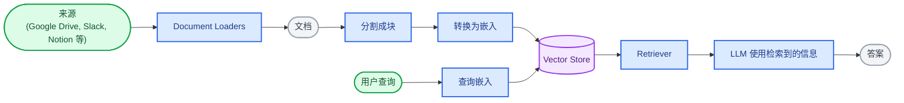
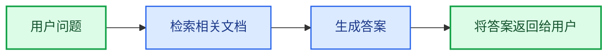
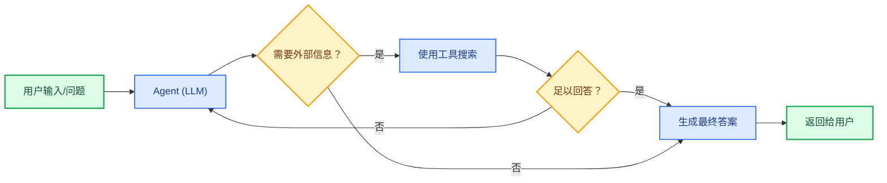
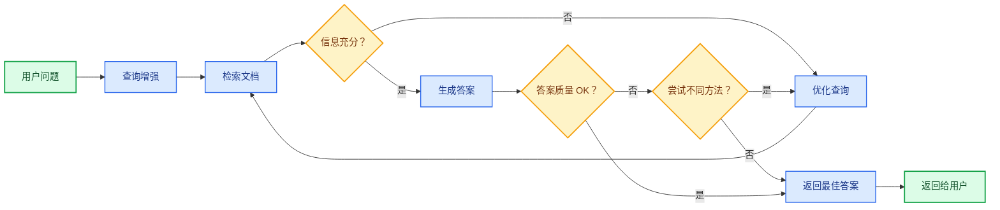

大型语言模型（LLM）功能强大，但它们有两个关键限制：

* **有限的上下文** — 它们无法一次性摄取整个语料库。
* **静态知识** — 它们的训练数据在某个时间点被冻结。

检索通过在查询时获取相关的外部知识来解决这些问题。这是 **检索增强生成（Retrieval-Augmented Generation，RAG）** 的基础：使用特定于上下文的信息增强 LLM 的答案。

## 构建知识库

**知识库** 是在检索期间使用的文档或结构化数据的存储库。

如果你需要自定义知识库，你可以使用 LangChain 的 Document Loaders 和 Vector Stores 从自己的数据构建一个。

<Note>
    如果你已经有了知识库（例如，SQL 数据库、CRM 或内部文档系统），你**不需要**重建它。你可以：
    - 将其作为 **工具** 连接到 Agentic RAG 中的 Agent。
    - 查询它并将检索到的内容作为上下文提供给 LLM [(2-Step RAG)](#2-step-rag)。
</Note>

请参阅以下教程来构建可搜索的知识库和最小化 RAG 工作流：

<Card
    title="教程：语义搜索"
    icon="database"
    href="/oss/langchain/knowledge-base"
    arrow cta="了解更多"
>
    学习如何使用 LangChain 的 Document Loaders、Embeddings 和 Vector Stores 从自己的数据创建可搜索的知识库。
    在本教程中，你将构建一个 PDF 搜索引擎，支持与查询相关的段落检索。你还将在该引擎之上实现最小化 RAG 工作流，以了解外部知识如何集成到 LLM 推理中。
</Card>

### 从检索到 RAG

检索允许 LLM 在运行时访问相关上下文。但大多数现实世界的应用更进一步：它们 **将检索与生成集成** 以生成有根据的、感知上下文的答案。

这是 **检索增强生成（RAG）** 背后的核心思想。检索管道成为更广泛系统的基础，该系统将搜索与生成相结合。

### 检索管道

典型的检索工作流如下所示：



每个组件都是模块化的：你可以交换 Loaders、Splitters、Embeddings 或 Vector Stores，而无需重写应用的逻辑。

### 构建模块

<Columns cols={2}>
    <Card
        title="Document Loaders（文档加载器）"
        icon="file-import"
        href="/oss/integrations/document_loaders"
        arrow cta="了解更多"
    >
        从外部源（Google Drive、Slack、Notion 等）摄取数据，返回标准化的 @[`Document`] 对象。
    </Card>

    :::python
    <Card
        title="Text Splitters（文本分割器）"
        icon="scissors"
        href="/oss/integrations/splitters"
        arrow
        cta="了解更多"
    >
        将大型文档分割成较小的块，这些块将单独可检索并适合模型的上下文窗口。
    </Card>
    :::

    <Card
        title="Embedding Models（嵌入模型）"
        icon="sitemap"
        href="/oss/integrations/text_embedding"
        arrow
        cta="了解更多"
    >
        嵌入模型将文本转换为数字向量，以便具有相似含义的文本在该向量空间中彼此靠近。
    </Card>

    <Card
        title="Vector Stores（向量存储）"
        icon="database"
        href="/oss/integrations/vectorstores/"
        arrow
        cta="了解更多"
    >
        用于存储和搜索嵌入的专用数据库。
    </Card>

    <Card
        title="Retrievers（检索器）"
        icon="binoculars"
        href="/oss/integrations/retrievers/"
        arrow
        cta="了解更多"
    >
        Retriever 是一个接口，根据非结构化查询返回文档。
    </Card>
</Columns>

## RAG 架构

RAG 可以根据系统需求以多种方式实现。我们在下面的部分中概述每种类型。

| 架构            | 描述                                                                | 控制   | 灵活性 | 延迟        | 示例用例                                   |
|-------------------------|----------------------------------------------------------------------------|-----------|-------------|----------------|----------------------------------------------------|
| **2-Step RAG**          | 检索总是在生成之前发生。简单且可预测         | ✅ 高    | ❌ 低       | ⚡ 快         | 常见问题解答、文档机器人                           |
| **Agentic RAG**         | 由 LLM 驱动的 Agent 在推理过程中决定 *何时* 和 *如何* 检索 | ❌ 低     | ✅ 高      | ⏳ 可变     | 可访问多个工具的研究助手  |
| **Hybrid（混合）**              | 结合两种方法的特点，带有验证步骤          | ⚖️ 中 | ⚖️ 中   | ⏳ 可变     | 具有质量验证的领域特定问答        |

<Info>
**延迟**：在 **2-Step RAG** 中，延迟通常更**可预测**，因为 LLM 调用的最大数量是已知且有上限的。这种可预测性假设 LLM 推理时间是主要因素。然而，现实世界的延迟也可能受到检索步骤性能的影响——例如 API 响应时间、网络延迟或数据库查询——这些可能因使用的工具和基础设施而异。
</Info>

### 2-Step RAG

在 **2-Step RAG** 中，检索步骤总是在生成步骤之前执行。这种架构简单直接且可预测，适用于许多应用，其中检索相关文档是生成答案的明确前提。



<Card
    title="教程：检索增强生成（RAG）"
    icon="robot"
    href="/oss/langchain/rag#rag-chains"
    arrow cta="了解更多"
>
    了解如何使用检索增强生成构建一个可以基于你的数据回答问题的问答聊天机器人。
    本教程介绍两种方法：
    * 一个 **RAG Agent**，使用灵活的工具运行搜索——非常适合通用用途。
    * 一个 **2-Step RAG** Chain，每个查询只需要一次 LLM 调用——对于简单任务快速高效。
</Card>

### Agentic RAG

**Agentic 检索增强生成（RAG）** 结合了检索增强生成与基于 Agent 的推理的优势。Agent（由 LLM 驱动）不是先检索文档再回答，而是逐步推理，并在交互过程中决定 **何时** 和 **如何** 检索信息。

<Tip>
Agent 实现 RAG 行为唯一需要的是访问一个或多个可以获取外部知识的 **工具**——例如文档加载器、Web API 或数据库查询。
</Tip>



:::python
```python
import requests
from langchain.tools import tool
from langchain.chat_models import init_chat_model
from langchain.agents import create_agent


@tool
def fetch_url(url: str) -> str:
    """从 URL 获取文本内容"""
    response = requests.get(url, timeout=10.0)
    response.raise_for_status()
    return response.text

system_prompt = """\
当你需要从网页获取信息时使用 fetch_url；引用相关片段。
"""

agent = create_agent(
    model="claude-sonnet-4-6",
    tools=[fetch_url], # 用于检索的工具 [!code highlight]
    system_prompt=system_prompt,
)
```
:::

:::js
```typescript
import { tool, createAgent } from "langchain";

const fetchUrl = tool(
    (url: string) => {
        return `从 ${url} 获取的内容`;
    },
    { name: "fetch_url", description: "从 URL 获取文本内容" }
);

const agent = createAgent({
    model: "claude-sonnet-4-0",
    tools: [fetchUrl],
    systemPrompt,
});
```
:::

<Expandable title="扩展示例：用于 LangGraph llms.txt 的 Agentic RAG">

此示例实现了一个 **Agentic RAG 系统**，帮助用户查询 LangGraph 文档。Agent 首先加载 [llms.txt](https://llmstxt.org/)，其中列出可用的文档 URL，然后可以动态使用 `fetch_documentation` 工具根据用户问题检索和处理相关内容。

:::python
```python
import requests
from langchain.agents import create_agent
from langchain.messages import HumanMessage
from langchain.tools import tool
from markdownify import markdownify


ALLOWED_DOMAINS = ["https://langchain-ai.github.io/"]
LLMS_TXT = 'https://langchain-ai.github.io/langgraph/llms.txt'


@tool
def fetch_documentation(url: str) -> str:  # [!code highlight]
    """从 URL 获取并转换文档"""
    if not any(url.startswith(domain) for domain in ALLOWED_DOMAINS):
        return (
            "错误：URL 不允许。"
            f"必须以下列之一开头：{', '.join(ALLOWED_DOMAINS)}"
        )
    response = requests.get(url, timeout=10.0)
    response.raise_for_status()
    return markdownify(response.text)


# 我们将获取 llms.txt 的内容，所以这可以
# 提前完成，无需 LLM 请求。
llms_txt_content = requests.get(LLMS_TXT).text

# Agent 的系统提示
system_prompt = f"""
你是一名专家 Python 开发人员和技术助手。
你的主要角色是帮助用户解答有关 LangGraph 和相关工具的问题。

说明：

1. 如果用户问了一个你不确定的问题——或者一个可能涉及 API 使用、
   行为或配置的问题——你**必须**使用 `fetch_documentation` 工具查阅相关文档。
2. 引用文档时，清晰总结并包含内容中的相关上下文。
3. 不要使用允许域之外的任何 URL。
4. 如果文档获取失败，告诉用户并继续提供你最好的专家理解。

你可以从以下批准的来源访问官方文档：

{llms_txt_content}

在回答用户关于 LangGraph 的问题之前，
你**必须**查阅文档以获取最新的文档。

你的答案应该清晰、简洁且在技术上准确。
"""

tools = [fetch_documentation]

model = init_chat_model("claude-sonnet-4-0", max_tokens=32_000)

agent = create_agent(
    model=model,
    tools=tools,  # [!code highlight]
    system_prompt=system_prompt,  # [!code highlight]
    name="Agentic RAG",
)

response = agent.invoke({
    'messages': [
        HumanMessage(content=(
            "使用预建的 create react agent 编写一个 langgraph agent 的简短示例。"
            "agent 应该能够查找股票价格信息。"
        ))
    ]
})

print(response['messages'][-1].content)
```
:::

:::js
```typescript
import { tool, createAgent, HumanMessage } from "langchain";
import * as z from "zod";

const ALLOWED_DOMAINS = ["https://langchain-ai.github.io/"];
const LLMS_TXT = "https://langchain-ai.github.io/langgraph/llms.txt";

const fetchDocumentation = tool(
  async (input) => {  # [!code highlight]
    if (!ALLOWED_DOMAINS.some((domain) => input.url.startsWith(domain))) {
      return `错误：URL 不允许。必须以下列之一开头：${ALLOWED_DOMAINS.join(", ")}`;
    }
    const response = await fetch(input.url);
    if (!response.ok) {
      throw new Error(`HTTP 错误！状态：${response.status}`);
    }
    return response.text();
  },
  {
    name: "fetch_documentation",
    description: "从 URL 获取并转换文档",
    schema: z.object({
      url: z.string().describe("要获取的文档 URL"),
    }),
  }
);

const llmsTxtResponse = await fetch(LLMS_TXT);
const llmsTxtContent = await llmsTxtResponse.text();

const systemPrompt = `
你是一名专家 TypeScript 开发人员和技术助手。
你的主要角色是帮助用户解答有关 LangGraph 和相关工具的问题。

说明：

1. 如果用户问了一个你不确定的问题——或者一个可能涉及 API 使用、
   行为或配置的问题——你**必须**使用 \`fetch_documentation\` 工具查阅相关文档。
2. 引用文档时，清晰总结并包含内容中的相关上下文。
3. 不要使用允许域之外的任何 URL。
4. 如果文档获取失败，告诉用户并继续提供你最好的专家理解。

你可以从以下批准的来源访问官方文档：

${llmsTxtContent}

在回答用户关于 LangGraph 的问题之前，
你**必须**查阅文档以获取最新的文档。

你的答案应该清晰、简洁且在技术上准确。
`;

const tools = [fetchDocumentation];

const agent = createAgent({
  model: "claude-sonnet-4-0"
  tools,  # [!code highlight]
  systemPrompt,  # [!code highlight]
  name: "Agentic RAG",
});

const response = await agent.invoke({
  messages: [
    new HumanMessage(
      "使用预建的 create react agent 编写一个 langgraph agent 的简短示例。" +
      "agent 应该能够查找股票价格信息。"
    ),
  ],
});

console.log(response.messages.at(-1)?.content);
```
:::
</Expandable>

<Card
    title="教程：检索增强生成（RAG）"
    icon="robot"
    href="/oss/langchain/rag"
    arrow cta="了解更多"
>
    了解如何使用检索增强生成构建一个可以基于你的数据回答问题的问答聊天机器人。
    本教程介绍两种方法：
    * 一个 **RAG Agent**，使用灵活的工具运行搜索——非常适合通用用途。
    * 一个 **2-Step RAG** Chain，每个查询只需要一次 LLM 调用——对于简单任务快速高效。
</Card>

### Hybrid RAG（混合 RAG）

Hybrid RAG 结合了 2-Step 和 Agentic RAG 的特点。它引入了中间步骤，如查询预处理、检索验证和生成后检查。这些系统比固定管道提供更大的灵活性，同时保持对执行的一些控制。

典型组件包括：

* **查询增强**：修改输入问题以提高检索质量。这可能涉及重写不清晰的查询、生成多个变体或使用额外上下文扩展查询。
* **检索验证**：评估检索到的文档是否相关且充分。如果不是，系统可以优化查询并再次检索。
* **答案验证**：检查生成的答案的准确性、完整性和与源内容的一致性。如果需要，系统可以重新生成或修改答案。

该架构通常支持这些步骤之间的多次迭代：



此架构适用于：

* 具有模糊或未充分指定查询的应用
* 需要验证或质量控制步骤的系统
* 涉及多个源或迭代优化的工作流

<Card
    title="教程：具有自校正的 Agentic RAG"
    icon="robot"
    href="/oss/langgraph/agentic-rag"
    arrow cta="了解更多"
>
    一个 **Hybrid RAG** 示例，结合了 Agent 推理与检索和自校正。
</Card>
