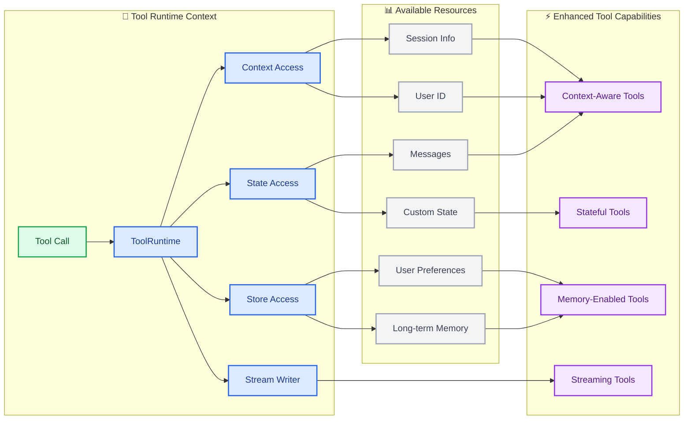

Tools 扩展了 [Agents（智能体）](/oss/langchain/agents) 的能力——让它们能够获取实时数据、执行代码、查询外部数据库并在现实世界中采取行动。

在底层，tools 是具有明确定义 inputs 和 outputs 的可调用函数，这些函数被传递给 [chat model](/oss/langchain/models)。Model 根据 conversation context 决定何时调用 tool，以及提供什么 input arguments。

<Tip>
    有关 models 如何处理 tool calls 的详情，请参阅 [Tool calling](/oss/langchain/models#tool-calling)。
</Tip>

## 创建工具

### 基本工具定义

:::python
创建 tool 最简单的方法是使用 @[`@tool`] 装饰器。默认情况下，函数的 docstring 成为 tool 的 description，帮助 model 理解何时使用它：

```python
from langchain.tools import tool

@tool
def search_database(query: str, limit: int = 10) -> str:
    """在客户数据库中搜索与查询匹配的记录。

    Args:
        query: 要查找的搜索词
        limit: 要返回的最大结果数
    """
    return f"Found {limit} results for '{query}'"
```

Type hints 是 **必需的**，因为它们定义了 tool 的 input schema。Docstring 应该信息丰富且简洁，以帮助 model 理解 tool 的 purpose。
:::

:::js
创建 tool 最简单的方法是从 `langchain` 包导入 `tool` 函数。你可以使用 [zod](https://zod.dev/) 来定义 tool 的 input schema：

```ts
import * as z from "zod"
import { tool } from "langchain"

const searchDatabase = tool(
  ({ query, limit }) => `Found ${limit} results for '${query}'`,
  {
    name: "search_database",
    description: "Search the customer database for records matching the query.",
    schema: z.object({
      query: z.string().describe("Search terms to look for"),
      limit: z.number().describe("Maximum number of results to return"),
    }),
  }
);
```
:::

<Note>
    **Server-side tool use:** 一些 chat models 具有内置工具（web search、code interpreters），这些工具在 server-side 执行。有关详情，请参阅 [Server-side tool use](#server-side-tool-use)。
</Note>

<Warning>
    优先使用 `snake_case` 作为 tool 名称（例如，`web_search` 而不是 `Web Search`）。一些 model providers 对包含空格或特殊字符的名称有问题或会拒绝并报错。坚持使用字母数字字符、下划线和连字符有助于提高跨 providers 的兼容性。
</Warning>

:::python
### 自定义工具属性

#### 自定义工具名称

默认情况下，tool 名称来自函数名。当你需要更具描述性的名称时覆盖它：

```python
@tool("web_search")  # 自定义名称
def search(query: str) -> str:
    """搜索网络获取信息。"""
    return f"Results for: {query}"

print(search.name)  # web_search
```

#### 自定义工具描述

覆盖自动生成的 tool description 以获得更清晰的 model guidance：

```python
@tool("calculator", description="Performs arithmetic calculations. Use this for any math problems.")
def calc(expression: str) -> str:
    """评估数学表达式。"""
    return str(eval(expression))
```

### 高级 schema 定义

使用 Pydantic models 或 JSON schemas 定义复杂 inputs：

<CodeGroup>
    ```python Pydantic model
    from pydantic import BaseModel, Field
    from typing import Literal

    class WeatherInput(BaseModel):
        """天气查询的输入。"""
        location: str = Field(description="城市名称或坐标")
        units: Literal["celsius", "fahrenheit"] = Field(
            default="celsius",
            description="温度单位偏好"
        )
        include_forecast: bool = Field(
            default=False,
            description="包含 5 天预报"
        )

    @tool(args_schema=WeatherInput)
    def get_weather(location: str, units: str = "celsius", include_forecast: bool = False) -> str:
        """获取当前天气和可选预报。"""
        temp = 22 if units == "celsius" else 72
        result = f"Current weather in {location}: {temp} degrees {units[0].upper()}"
        if include_forecast:
            result += "\nNext 5 days: Sunny"
        return result
    ```

    ```python JSON Schema
    weather_schema = {
        "type": "object",
        "properties": {
            "location": {"type": "string"},
            "units": {"type": "string"},
            "include_forecast": {"type": "boolean"}
        },
        "required": ["location", "units", "include_forecast"]
    }

    @tool(args_schema=weather_schema)
    def get_weather(location: str, units: str = "celsius", include_forecast: bool = False) -> str:
        """获取当前天气和可选预报。"""
        temp = 22 if units == "celsius" else 72
        result = f"Current weather in {location}: {temp} degrees {units[0].upper()}"
        if include_forecast:
            result += "\nNext 5 days: Sunny"
        return result
    ```
</CodeGroup>

### 保留参数名称

以下参数名称是保留的，不能用作 tool arguments。使用这些名称将导致 runtime errors。

| 参数名称 | 用途 |
|----------------|---------|
| `config` | 用于在内部向 tools 传递 `RunnableConfig` |
| `runtime` | 用于 `ToolRuntime` 参数（访问 state、context、store） |

要访问 runtime 信息，使用 @[`ToolRuntime`] 参数而不是将你自己的 arguments 命名为 `config` 或 `runtime`。
:::

## 访问上下文

当 tools 能够访问 runtime 信息（如 conversation history、user data 和 persistent memory）时，它们最强大。本节介绍如何从你的 tools 内部访问和更新这些信息。

:::python
Tools 可以通过 @[`ToolRuntime`] 参数访问 runtime 信息，它提供：

| 组件 | 描述 | 用例 |
|-----------|-------------|----------|
| **State** | Short-term memory - 为当前 conversation 存在的 mutable data（messages、counters、custom fields） | 访问 conversation history、跟踪 tool call counts |
| **Context** | 在 invocation time 传递的 immutable configuration（user IDs、session info） | 基于 user identity 个性化 responses |
| **Store** | Long-term memory - 在 conversations 之间持续的 persistent data | 保存 user preferences、维护 knowledge base |
| **Stream Writer** | 在 tool execution 期间 emit real-time updates | 为 long-running operations 显示 progress |
| **Config** | execution 的 @[`RunnableConfig`] | 访问 callbacks、tags 和 metadata |
| **Tool Call ID** | 当前 tool invocation 的唯一 identifier | 为 logs 和 model invocations 关联 tool calls |



### 短期记忆（State）

State 表示在 conversation 持续期间存在的 short-term memory。它包括 message history 和你在 [graph state](/oss/langgraph/graph-api#state) 中定义的任何 custom fields。

<Info>
    将 `runtime: ToolRuntime` 添加到你的 tool signature 以访问 state。这个参数会自动注入并对 LLM 隐藏——它不会出现在 tool 的 schema 中。
</Info>

#### 访问 state

Tools 可以使用 `runtime.state` 访问当前 conversation state：

```python
from langchain.tools import tool, ToolRuntime
from langchain.messages import HumanMessage

@tool
def get_last_user_message(runtime: ToolRuntime) -> str:
    """获取用户的最近消息。"""
    messages = runtime.state["messages"]

    # 查找最后一条 human message
    for message in reversed(messages):
        if isinstance(message, HumanMessage):
            return message.content

    return "No user messages found"

# 访问 custom state fields
@tool
def get_user_preference(
    pref_name: str,
    runtime: ToolRuntime
) -> str:
    """获取用户偏好值。"""
    preferences = runtime.state.get("user_preferences", {})
    return preferences.get(pref_name, "Not set")
```

<Warning>
    `runtime` 参数对 model 隐藏。对于上面的例子，model 只在 tool schema 中看到 `pref_name`。
</Warning>

#### 更新 state

使用 @[`Command`] 更新 agent 的 state。这对于需要更新 custom state fields 的 tools 很有用：

```python
from langgraph.types import Command
from langchain.tools import tool

@tool
def set_user_name(new_name: str) -> Command:
    """在 conversation state 中设置用户的名称。"""
    return Command(update={"user_name": new_name})
```

<Tip>
    当 tools 更新 state variables 时，考虑为这些 fields 定义 [reducer](/oss/langgraph/graph-api#reducers)。由于 LLMs 可以并行调用多个 tools，reducer 确定如何在 concurrent tool calls 更新相同 state field 时解决冲突。
</Tip>
:::

### Context（上下文）

Context 提供在 invocation time 传递的 immutable configuration data。将它用于 user IDs、session details 或在 conversation 期间不应更改的 application-specific settings。

:::python
通过 `runtime.context` 访问 context：

```python
from dataclasses import dataclass
from langchain_openai import ChatOpenAI
from langchain.agents import create_agent
from langchain.tools import tool, ToolRuntime


USER_DATABASE = {
    "user123": {
        "name": "Alice Johnson",
        "account_type": "Premium",
        "balance": 5000,
        "email": "alice@example.com"
    },
    "user456": {
        "name": "Bob Smith",
        "account_type": "Standard",
        "balance": 1200,
        "email": "bob@example.com"
    }
}

@dataclass
class UserContext:
    user_id: str

@tool
def get_account_info(runtime: ToolRuntime[UserContext]) -> str:
    """获取当前用户的账户信息。"""
    user_id = runtime.context.user_id

    if user_id in USER_DATABASE:
        user = USER_DATABASE[user_id]
        return f"Account holder: {user['name']}\nType: {user['account_type']}\nBalance: ${user['balance']}"
    return "User not found"

model = ChatOpenAI(model="gpt-4.1")
agent = create_agent(
    model,
    tools=[get_account_info],
    context_schema=UserContext,
    system_prompt="You are a financial assistant."
)

result = agent.invoke(
    {"messages": [{"role": "user", "content": "What's my current balance?"}]},
    context=UserContext(user_id="user123")
)
```
:::

:::js
Tools 可以通过 `config` 参数访问 agent 的 runtime context：

```ts
import * as z from "zod"
import { ChatOpenAI } from "@langchain/openai"
import { createAgent } from "langchain"

const getUserName = tool(
  (_, config) => {
    return config.context.user_name
  },
  {
    name: "get_user_name",
    description: "Get the user's name.",
    schema: z.object({}),
  }
);

const contextSchema = z.object({
  user_name: z.string(),
});

const agent = createAgent({
  model: new ChatOpenAI({ model: "gpt-4.1" }),
  tools: [getUserName],
  contextSchema,
});

const result = await agent.invoke(
  {
    messages: [{ role: "user", content: "What is my name?" }]
  },
  {
    context: { user_name: "John Smith" }
  }
);
```
:::

### 长期记忆（Store）

@[`BaseStore`] 提供在 conversations 之间持续的 persistent storage。与 state（short-term memory）不同，保存到 store 的数据在未来 sessions 中仍然可用。

:::python
通过 `runtime.store` 访问 store。Store 使用 namespace/key pattern 来组织数据：

<Tip>
    对于 production deployments，使用 persistent store implementation 如 @[`PostgresStore`] 而不是 `InMemoryStore`。有关 setup details，请参阅 [memory documentation](/oss/langgraph/memory)。
</Tip>

```python expandable
from typing import Any
from langgraph.store.memory import InMemoryStore
from langchain.agents import create_agent
from langchain.tools import tool, ToolRuntime


# 访问 memory
@tool
def get_user_info(user_id: str, runtime: ToolRuntime) -> str:
    """查找用户信息。"""
    store = runtime.store
    user_info = store.get(("users",), user_id)
    return str(user_info.value) if user_info else "Unknown user"

# 更新 memory
@tool
def save_user_info(user_id: str, user_info: dict[str, Any], runtime: ToolRuntime) -> str:
    """保存用户信息。"""
    store = runtime.store
    store.put(("users",), user_id, user_info)
    return "Successfully saved user info."

store = InMemoryStore()
agent = create_agent(
    model,
    tools=[get_user_info, save_user_info],
    store=store
)

# 第一个 session：保存用户信息
agent.invoke({
    "messages": [{"role": "user", "content": "Save the following user: userid: abc123, name: Foo, age: 25, email: foo@langchain.dev"}]
})

# 第二个 session：获取用户信息
agent.invoke({
    "messages": [{"role": "user", "content": "Get user info for user with id 'abc123'"}]
})
# 这是 ID 为 "abc123" 的用户的用户信息：
# - Name: Foo
# - Age: 25
# - Email: foo@langchain.dev
```
:::

:::js
通过 `config.store` 访问 store。Store 使用 namespace/key pattern 来组织数据：

```ts expandable
import * as z from "zod";
import { createAgent, tool } from "langchain";
import { InMemoryStore } from "@langchain/langgraph";
import { ChatOpenAI } from "@langchain/openai";

const store = new InMemoryStore();

// 访问 memory
const getUserInfo = tool(
  async ({ user_id }) => {
    const value = await store.get(["users"], user_id);
    console.log("get_user_info", user_id, value);
    return value;
  },
  {
    name: "get_user_info",
    description: "Look up user info.",
    schema: z.object({
      user_id: z.string(),
    }),
  }
);

// 更新 memory
const saveUserInfo = tool(
  async ({ user_id, name, age, email }) => {
    console.log("save_user_info", user_id, name, age, email);
    await store.put(["users"], user_id, { name, age, email });
    return "Successfully saved user info.";
  },
  {
    name: "save_user_info",
    description: "Save user info.",
    schema: z.object({
      user_id: z.string(),
      name: z.string(),
      age: z.number(),
      email: z.string(),
    }),
  }
);

const agent = createAgent({
  model: new ChatOpenAI({ model: "gpt-4.1" }),
  tools: [getUserInfo, saveUserInfo],
  store,
});

// 第一个 session：保存用户信息
await agent.invoke({
  messages: [
    {
      role: "user",
      content: "Save the following user: userid: abc123, name: Foo, age: 25, email: foo@langchain.dev",
    },
  ],
});

// 第二个 session：获取用户信息
const result = await agent.invoke({
  messages: [
    { role: "user", content: "Get user info for user with id 'abc123'" },
  ],
});

console.log(result);
// 这是 ID 为 "abc123" 的用户的用户信息：
// - Name: Foo
// - Age: 25
// - Email: foo@langchain.dev
```
:::

### Stream writer（流式写入器）

在 execution 期间从 tools stream real-time updates。这对于在 long-running operations 期间向用户提供 progress feedback 很有用。

:::python
使用 `runtime.stream_writer` emit custom updates：

```python
from langchain.tools import tool, ToolRuntime

@tool
def get_weather(city: str, runtime: ToolRuntime) -> str:
    """获取给定城市的天气。"""
    writer = runtime.stream_writer

    # 在 tool 执行时 stream custom updates
    writer(f"Looking up data for city: {city}")
    writer(f"Acquired data for city: {city}")

    return f"It's always sunny in {city}!"
```

<Note>
如果你在 tool 中使用 `runtime.stream_writer`，tool 必须在 LangGraph execution context 中调用。有关更多详情，请参阅 [Streaming](/oss/langchain/streaming)。
</Note>
:::

:::js
使用 `config.writer` emit custom updates：

```ts
import * as z from "zod";
import { tool, ToolRuntime } from "langchain";

const getWeather = tool(
  ({ city }, config: ToolRuntime) => {
    const writer = config.writer;

    // 在 tool 执行时 stream custom updates
    if (writer) {
      writer(`Looking up data for city: ${city}`);
      writer(`Acquired data for city: ${city}`);
    }

    return `It's always sunny in ${city}!`;
  },
  {
    name: "get_weather",
    description: "Get weather for a given city.",
    schema: z.object({
      city: z.string(),
    }),
  }
);
```
:::

## ToolNode

@[`ToolNode`] 是一个预构建的 node，在 LangGraph workflows 中执行 tools。它自动处理 parallel tool execution、error handling 和 state injection。

<Info>
    对于需要 fine-grained control over tool execution patterns 的 custom workflows，使用 @[`ToolNode`] 而不是 @[`create_agent`]。它是 powers agent tool execution 的 building block。
</Info>

### 基本用法

:::python
```python
from langchain.tools import tool
from langgraph.prebuilt import ToolNode
from langgraph.graph import StateGraph, MessagesState, START, END

@tool
def search(query: str) -> str:
    """搜索信息。"""
    return f"Results for: {query}"

@tool
def calculator(expression: str) -> str:
    """评估数学表达式。"""
    return str(eval(expression))

# 用你的 tools 创建 ToolNode
tool_node = ToolNode([search, calculator])

# 在 graph 中使用
builder = StateGraph(MessagesState)
builder.add_node("tools", tool_node)
# ... 添加其他 nodes 和 edges
```
:::

:::js
```typescript
import { ToolNode } from "@langchain/langgraph/prebuilt";
import { tool } from "@langchain/core/tools";
import * as z from "zod";

const search = tool(
  ({ query }) => `Results for: ${query}`,
  {
    name: "search",
    description: "Search for information.",
    schema: z.object({ query: z.string() }),
  }
);

const calculator = tool(
  ({ expression }) => String(eval(expression)),
  {
    name: "calculator",
    description: "Evaluate a math expression.",
    schema: z.object({ expression: z.string() }),
  }
);

// 用你的 tools 创建 ToolNode
const toolNode = new ToolNode([search, calculator]);
```
:::

### 工具返回值

你可以为 tools 选择不同的 return values：

- 返回 `string` 用于 human-readable results。
- 返回 `object` 用于 model 应该 parse 的 structured results。
- 当你需要写入 state 时返回带有 optional message 的 `Command`。

#### 返回字符串

当 tool 应该提供 plain text 供 model 读取并在其 next response 中使用时，返回 string。

:::python

<ToolReturnValuesPy />

:::

:::js

<ToolReturnValuesJs />

:::

Behavior：

- return value 被转换为 `ToolMessage`。
- model 看到该 text 并决定下一步做什么。
- 除非 model 或另一个 tool 稍后这样做，否则不会更改 agent state fields。

当 result 是 naturally human-readable text 时使用这个。

#### 返回对象

当你的 tool 产生 model 应该 inspect 的 structured data 时，返回 object（例如，`dict`）。

:::python

<ToolReturnObjectPy />

:::

:::js

<ToolReturnObjectJs />

:::

Behavior：

- object 被序列化并作为 tool output 发送回去。
- model 可以读取 specific fields 并在它们之上 reasoning。
- 与 string returns 一样，这不会直接更新 graph state。

当 downstream reasoning 受益于 explicit fields 而不是 free-form text 时使用这个。

#### 返回 Command

当 tool 需要更新 graph state（例如，设置 user preferences 或 app state）时，返回 @[`Command`]。
你可以返回带有或不包含 `ToolMessage` 的 `Command`。
如果 model 需要看到 tool 成功了（例如，确认 preference change），在 update 中包含 `ToolMessage`，使用 `runtime.tool_call_id` 作为 `tool_call_id` 参数。

:::python

<ToolReturnCommandPy />

:::

:::js

<ToolReturnCommandJs />

:::

Behavior：

- command 使用 `update` 更新 state。
- updated state 在同一次 run 的 subsequent steps 中可用。
- 对可能被 parallel tool calls 更新的 fields 使用 reducers。

当 tool 不仅仅是返回 data，而且还 mutating agent state 时使用这个。

### 错误处理

配置如何处理 tool errors。有关所有选项，请参阅 @[`ToolNode`] API reference。

:::python
```python
from langgraph.prebuilt import ToolNode

# 默认：catch invocation errors，re-raise execution errors
tool_node = ToolNode(tools)

# Catch all errors 并返回 error message 给 LLM
tool_node = ToolNode(tools, handle_tool_errors=True)

# 自定义 error message
tool_node = ToolNode(tools, handle_tool_errors="Something went wrong, please try again.")

# 自定义 error handler
def handle_error(e: ValueError) -> str:
    return f"Invalid input: {e}"

tool_node = ToolNode(tools, handle_tool_errors=handle_error)

# 仅 catch specific exception types
tool_node = ToolNode(tools, handle_tool_errors=(ValueError, TypeError))
```
:::

:::js
```typescript
import { ToolNode } from "@langchain/langgraph/prebuilt";

// 默认 behavior
const toolNode = new ToolNode(tools);

// Catch all errors
const toolNode = new ToolNode(tools, { handleToolErrors: true });

// 自定义 error message
const toolNode = new ToolNode(tools, {
  handleToolErrors: "Something went wrong, please try again."
});
```
:::

### 使用 tools_condition 路由

使用 @[`tools_condition`] 基于 LLM 是否进行了 tool calls 进行 conditional routing：

:::python
```python
from langgraph.prebuilt import ToolNode, tools_condition
from langgraph.graph import StateGraph, MessagesState, START, END

builder = StateGraph(MessagesState)
builder.add_node("llm", call_llm)
builder.add_node("tools", ToolNode(tools))

builder.add_edge(START, "llm")
builder.add_conditional_edges("llm", tools_condition)  # 路由到 "tools" 或 END
builder.add_edge("tools", "llm")

graph = builder.compile()
```
:::

:::js
```typescript
import { ToolNode, toolsCondition } from "@langchain/langgraph/prebuilt";
import { StateGraph, MessagesAnnotation } from "@langchain/langgraph";

const builder = new StateGraph(MessagesAnnotation)
  .addNode("llm", callLlm)
  .addNode("tools", new ToolNode(tools))
  .addEdge("__start__", "llm")
  .addConditionalEdges("llm", toolsCondition)  # 路由到 "tools" 或 "__end__"
  .addEdge("tools", "llm");

const graph = builder.compile();
```
:::

### State injection

Tools 可以通过 @[`ToolRuntime`] 访问当前 graph state：

:::python
```python
from langchain.tools import tool, ToolRuntime
from langgraph.prebuilt import ToolNode

@tool
def get_message_count(runtime: ToolRuntime) -> str:
    """获取 conversation 中的消息数。"""
    messages = runtime.state["messages"]
    return f"There are {len(messages)} messages."

tool_node = ToolNode([get_message_count])
```
:::

有关从 tools 访问 state、context 和 long-term memory 更多信息，请参阅 [Access context](#access-context)。

## 预构建工具

LangChain 为 common tasks（如 web search、code interpretation、database access 等）提供了大量 prebuilt tools 和 toolkits。这些 ready-to-use tools 可以直接集成到你的 agents 中，无需编写 custom code。

查看 [tools and toolkits](/oss/integrations/tools) integration page 获取按 category 组织的 available tools 完整列表。

## Server-side tool use（服务端工具使用）

一些 chat models 具有由 model provider 在 server-side 执行的 built-in tools。这些包括 capabilities（如 web search 和 code interpreters），不需要你定义或 host tool logic。

请参阅单独的 [chat model integration pages](/oss/integrations/providers) 和 [tool calling documentation](/oss/langchain/models#server-side-tool-use) 获取启用和使用这些 built-in tools 的详情。
