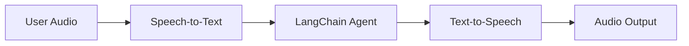
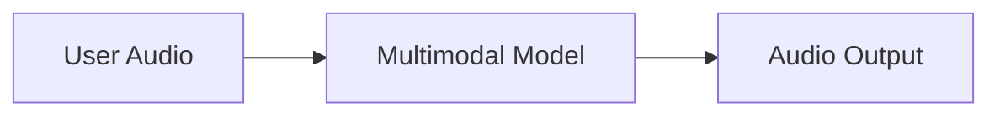

## 概述

Chat interfaces 主导了我们与 AI 交互的方式，但最近 multimodal AI 的突破正在开启令人兴奋的新可能性。高质量的 generative models 和 expressive text-to-speech (TTS) systems 现在使得构建感觉更像 conversational partners 而不是 tools 的 agents 成为可能。

Voice agents 就是这样一个例子。你可以使用 spoken words 与 agent 交互，而不是依赖 keyboard 和 mouse 输入。这可能是更自然和引人入胜的与 AI 交互方式，在某些上下文中特别有用。

### 什么是 Voice agents？

Voice agents 是可以与 users 进行自然 spoken conversations 的 [agents](/oss/langchain/agents)。这些 agents 结合 speech recognition、natural language processing、generative AI 和 text-to-speech technologies 来创建 seamless、natural conversations。

它们适用于各种用例，包括：

- Customer support
- Personal assistants
- Hands-free interfaces
- Coaching and training

### Voice agents 如何工作？

总体而言，每个 voice agent 需要处理三个任务：

1. **Listen** - capture audio 并 transcribe
2. **Think** - interpret intent、reason、plan
3. **Speak** - generate audio 并 stream 回 user

区别在于这些步骤如何排序和耦合。在实践中，production agents 遵循两种主要架构之一：

#### 1. STT > Agent > TTS architecture（"Sandwich"）

Sandwich architecture 组合三个不同的 components：speech-to-text (STT)、text-based LangChain agent 和 text-to-speech (TTS)。



**Pros:**
- 完全控制每个 component（根据需要 swap STT/TTS providers）
- 访问 modern text-modality models 的最新功能
- 透明行为，components 之间有清晰边界

**Cons:**
- 需要 orchestrate multiple services
- 管理 pipeline 的额外复杂性
- speech to text 转换丢失信息（如 tone、emotion）

#### 2. Speech-to-Speech architecture (S2S)

Speech-to-speech 使用 multimodal model 原生处理 audio input 并生成 audio output。



**Pros:**
- 更简单的 architecture，moving parts 更少
- 通常 simple interactions 的 latency 更低
- Direct audio processing captures tone 和其他 speech nuances

**Cons:**
- Limited model options，provider lock-in 风险更大
- Features 可能落后于 text-modality models
- audio processing 的透明度降低
- Controllability 和 customization options 减少

本指南演示 **sandwich architecture** 以平衡 performance、controllability 和访问 modern model capabilities。使用一些 STT 和 TTS providers，sandwich 可以实现 sub-700ms latency，同时保持对 modular components 的控制。

### Demo Application overview

我们将 walkthrough 使用 sandwich architecture 构建 voice-based agent。agent 将管理 sandwich shop 的 orders。应用程序将演示 sandwich architecture 的所有三个 components，使用 [AssemblyAI](https://www.assemblyai.com/) 进行 STT，[Cartesia](https://cartesia.ai/) 进行 TTS（尽管可以为大多数 providers 构建 adapters）。

[voice-sandwich-demo](https://github.com/langchain-ai/voice-sandwich-demo) 仓库中提供端到端 reference application。我们将在此 walkthrough 该应用程序。

demo 使用 WebSockets 在 browser 和 server 之间进行 real-time bidirectional communication。相同的 architecture 可以适应其他 transports，如 telephony systems (Twilio, Vonage) 或 WebRTC connections。

### Architecture

demo 实现 streaming pipeline，其中每个 stage 异步处理数据：

**Client (Browser)**
- Captures microphone audio 并编码为 PCM
- Establishes WebSocket connection 到 backend server
- Streams audio chunks 到 server in real-time
- Receives and plays back synthesized speech audio

**Server (Python/Node.js)**
- Accepts WebSocket connections from clients
- Orchestrates three-step pipeline:
  - [Speech-to-text (STT)](#1-speech-to-text): Forwards audio to STT provider (e.g., AssemblyAI), receives transcript events
  - [Agent](#2-langchain-agent): Processes transcripts with LangChain agent, streams response tokens
  - [Text-to-speech (TTS)](#3-text-to-speech): Sends agent responses to TTS provider (e.g., Cartesia), receives audio chunks
- Returns synthesized audio to client for playback

pipeline 使用 async generators 在每个 stage 启用 streaming。这允许 downstream components 在 upstream stages 完成之前开始处理，最小化 end-to-end latency。

## 设置

有关详细 installation instructions 和 setup，请参阅 [repository README](https://github.com/langchain-ai/voice-sandwich-demo#readme)。

## 1. Speech-to-text

STT stage 将 incoming audio stream 转换为 text transcripts。implementation 使用 producer-consumer pattern 来 concurrently handle audio streaming 和 transcript reception。

### Key concepts

**Producer-Consumer Pattern**: Audio chunks 被 concurrently sent 到 STT service，同时 receiving transcript events。这允许 transcription 在 all audio 到达之前开始。

**Event Types**:
- `stt_chunk`: Partial transcripts provided as STT service processes audio
- `stt_output`: Final, formatted transcripts that trigger agent processing

**WebSocket Connection**: Maintains persistent connection to AssemblyAI's real-time STT API, configured for 16kHz PCM audio with automatic turn formatting.

### Implementation

:::python
```python
from typing import AsyncIterator
import asyncio
from assemblyai_stt import AssemblyAISTT
from events import VoiceAgentEvent

async def stt_stream(
    audio_stream: AsyncIterator[bytes],
) -> AsyncIterator[VoiceAgentEvent]:
    """
    Transform stream: Audio (Bytes) → Voice Events (VoiceAgentEvent)

    Uses a producer-consumer pattern where:
    - Producer: Reads audio chunks and sends them to AssemblyAI
    - Consumer: Receives transcription events from AssemblyAI
    """
    stt = AssemblyAISTT(sample_rate=16000)

    async def send_audio():
        """Background task that pumps audio chunks to AssemblyAI."""
        try:
            async for audio_chunk in audio_stream:
                await stt.send_audio(audio_chunk)
        finally:
            # Signal completion when audio stream ends
            await stt.close()

    # Launch audio sending in background
    send_task = asyncio.create_task(send_audio())

    try:
        # Receive and yield transcription events as they arrive
        async for event in stt.receive_events():
            yield event
    finally:
        # Cleanup
        with contextlib.suppress(asyncio.CancelledError):
            send_task.cancel()
            await send_task
        await stt.close()
```
:::

## 2. LangChain agent

Agent stage 通过 LangChain [agent](/oss/langchain/agents) 处理 text transcripts 并 stream response tokens。在这种情况下，我们 stream agent 生成的所有 [text content blocks](/oss/langchain/messages#textcontentblock)。

### Key concepts

**Streaming Responses**: Agent 使用 [`stream_mode="messages"`](/oss/langchain/streaming#llm-tokens) 来 emit response tokens as they're generated，而不是等待 complete response。这使 TTS stage 能够立即开始 synthesis。

**Conversation Memory**: [Checkpointer](/oss/langchain/short-term-memory) 使用唯一 thread ID 在 turns 之间维护 conversation state。这允许 agent 在 conversation 中引用 previous exchanges。

### Implementation

:::python
```python
from uuid import uuid4
from langchain.agents import create_agent
from langchain.messages import HumanMessage
from langgraph.checkpoint.memory import InMemorySaver

# Define agent tools
def add_to_order(item: str, quantity: int) -> str:
    """Add an item to the customer's sandwich order."""
    return f"Added {quantity} x {item} to the order."

def confirm_order(order_summary: str) -> str:
    """Confirm the final order with the customer."""
    return f"Order confirmed: {order_summary}. Sending to kitchen."

# Create agent with tools and memory
agent = create_agent(
    model="anthropic:claude-haiku-4-5",  # Select your model
    tools=[add_to_order, confirm_order],
    system_prompt="""You are a helpful sandwich shop assistant.
    Your goal is to take the user's order. Be concise and friendly.
    Do NOT use emojis, special characters, or markdown.
    Your responses will be read by a text-to-speech engine.""",
    checkpointer=InMemorySaver(),
)

async def agent_stream(
    event_stream: AsyncIterator[VoiceAgentEvent],
) -> AsyncIterator[VoiceAgentEvent]:
    """
    Transform stream: Voice Events → Voice Events (with Agent Responses)

    Passes through all upstream events and adds agent_chunk events
    when processing STT transcripts.
    """
    # Generate unique thread ID for conversation memory
    thread_id = str(uuid4())

    async for event in event_stream:
        # Pass through all upstream events
        yield event

        # Process final transcripts through the agent
        if event.type == "stt_output":
            # Stream agent response with conversation context
            stream = agent.astream(
                {"messages": [HumanMessage(content=event.transcript)]},
                {"configurable": {"thread_id": thread_id}},
                stream_mode="messages",
            )

            # Yield agent response chunks as they arrive
            async for message, _ in stream:
                if message.text:
                    yield AgentChunkEvent.create(message.text)
```
:::

## 3. Text-to-speech

TTS stage 将 agent response text 合成为 audio 并 stream 回 client。像 STT stage 一样，它使用 producer-consumer pattern 来 handle concurrent text sending 和 audio reception。

### Key concepts

**Concurrent Processing**: Implementation merges two async streams:
- **Upstream processing**: Passes through all events and sends agent text chunks to TTS provider
- **Audio reception**: Receives synthesized audio chunks from TTS provider

**Streaming TTS**: Some providers (如 [Cartesia](https://cartesia.ai/)) 在收到 text 后立即开始 synthesizing audio，使 audio playback 可以在 agent 完成生成 complete response 之前开始。

**Event Passthrough**: All upstream events flow through unchanged，允许 client 或其他 observers track full pipeline state。

### Implementation

:::python
```python
from cartesia_tts import CartesiaTTS
from utils import merge_async_iters

async def tts_stream(
    event_stream: AsyncIterator[VoiceAgentEvent],
) -> AsyncIterator[VoiceAgentEvent]:
    """
    Transform stream: Voice Events → Voice Events (with Audio)

    Merges two concurrent streams:
    1. process_upstream(): passes through events and sends text to Cartesia
    2. tts.receive_events(): yields audio chunks from Cartesia
    """
    tts = CartesiaTTS()

    async def process_upstream() -> AsyncIterator[VoiceAgentEvent]:
        """Process upstream events and send agent text to Cartesia."""
        async for event in event_stream:
            # Pass through all events
            yield event
            # Send agent text to Cartesia for synthesis
            if event.type == "agent_chunk":
                await tts.send_text(event.text)

    try:
        # Merge upstream events with TTS audio events
        # Both streams run concurrently
        async for event in merge_async_iters(
            process_upstream(),
            tts.receive_events()
        ):
            yield event
    finally:
        await tts.close()
```
:::

## LangSmith

你使用 LangChain 构建的许多应用程序将包含多个步骤和多次 LLM 调用。随着这些应用程序变得越来越复杂，能够检查 chain 或 agent 内部发生的事情变得至关重要。最好的方法是使用 [LangSmith](https://smith.langchain.com)。

在上面的链接注册后，确保设置环境变量以开始记录 traces：

```shell
export LANGSMITH_TRACING="true"
export LANGSMITH_API_KEY="..."
```

## 整合在一起

Complete pipeline 将三个 stages 链接在一起：

:::python
```python
from langchain_core.runnables import RunnableGenerator

pipeline = (
    RunnableGenerator(stt_stream)      # Audio → STT events
    | RunnableGenerator(agent_stream)  # STT events → Agent events
    | RunnableGenerator(tts_stream)    # Agent events → TTS audio
)

# Use in WebSocket endpoint
@app.websocket("/ws")
async def websocket_endpoint(websocket: WebSocket):
    await websocket.accept()

    async def websocket_audio_stream():
        """Yield audio bytes from WebSocket."""
        while True:
            data = await websocket.receive_bytes()
            yield data

    # Transform audio through pipeline
    output_stream = pipeline.atransform(websocket_audio_stream())

    # Send TTS audio back to client
    async for event in output_stream:
        if event.type == "tts_chunk":
            await websocket.send_bytes(event.audio)
```

我们使用 [RunnableGenerators](https://reference.langchain.com/python/langchain_core/runnables/#langchain_core.runnables.base.RunnableGenerator) 来 compose pipeline 的每个 step。这是 LangChain 内部用于管理 [streaming across components](https://reference.langchain.com/python/langchain_core/runnables/) 的 abstraction。
:::

每个 stage 独立且 concurrently 处理 events：audio transcription 在 audio 到达时立即开始，agent 在 transcript 可用时立即开始 reasoning，speech synthesis 在 agent text 生成时立即开始。此 architecture 可以实现 sub-700ms latency 以支持 natural conversation。

有关使用 LangChain 构建 agents 的更多信息，请参阅 [Agents guide](/oss/langchain/agents)。
