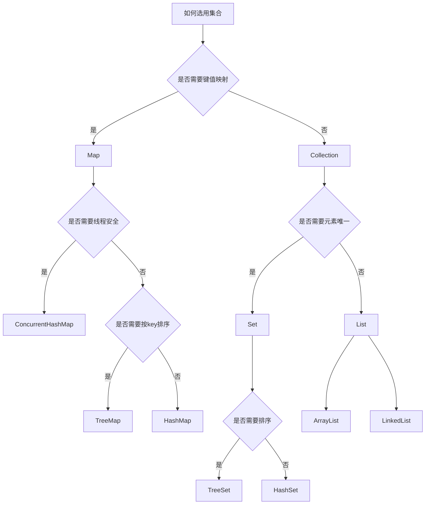

## 为什么需要集合？ ##

- 代码几乎都是**对数据的处理**，数据的存放容器和操作就至关重要

- **数组**：容量固定、插入删除成本高、缺乏丰富封装好的 api 支持

- **集合框架**：统一接口，并且有多种成熟实现（List / Set / Queue / Map）+ 丰富算法

  **带来的结果**：更容易使用，更容易维护；并且并发场景有对应安全实现可选

## 什么是集合？ ##

- 存储数据的容器
- 支持泛型
- 统一的抽象接口
- 丰富的 api
- 提供并发版本

## 集合类型 ##

集合框架整体可分为**两大接口**，**Collection** 下面有三个大分类，`Map` 本身并不继承自 `Collection` 接口，它是并列的一个接口（不过依旧是集合框架的一部分）：

- **Collection** 接口：单一元素
  - **List**：列表，用于存储有序、允许重复的元素
    - `ArrayList`：底层是 `Object[]` 数组
    - `LinkedList`：底层是双向链表
    - `Vector`：`Object[]` 数组（过时设计，不推荐）
  - **Set**：集合，用于存储唯一的元素
    - `HashSet`：无序、唯一，底层是 `HashMap`
      - `LinkedHashSet`：`HashSet` 子类，底层是 `LinkedHashMap`
    - `SortedSet`：有序 Set 接口
      - `TreeSet`：有序、唯一；底层是红黑树
  - **Queue**：队列，用于按顺序处理元素
    - `PriorityQueue`：优先级队列，底层是二叉堆，默认小顶堆
    - `Deque`：双端队列，可以作为栈，也可以作为队列使用
      - `ArrayDeque`：底层是 `Object[]` 数组
      - `LinkedList`：底层是双向链表
- **Map** 接口：键值对，键唯一，值可重复
  - `HashMap`：底层是哈希表，采用拉链法解决冲突，允许 `null` 键和 `null` 值
    - `LinkedHashMap`：底层是哈希表 + 双向链表，在 `HashMap` 基础上**维护遍历顺序**
  - `Hashtable`：性能和设计较旧（不推荐）
  - `SortedMap`：
    - `TreeMap`：底层是红黑树，按照 key 排序
  - `ConcurrentHashMap`：
    - 高并发、多线程场景下使用

  
  以上图片来自Javaguide网站

## 使用场景 ##

先考虑是否需要键值映射：

- 如果需要，优先考虑用 Map：
  - 需要排序就使用 `TreeMap`
  - 是高并发、多线程下，考虑使用 `ConcurrentHashMap`
  - 其他大部分场景一般可以使用 `HashMap`

- 如果只是存放元素，考虑 `Collection` 下面的接口集合：
  - 需要保证元素唯一选择 `Set` 接口下的集合
  - 不需要唯一性就选择 `List` 接口下的集合
  - 如果是队列或者栈，考虑使用 `Queue` 接口下的集合

